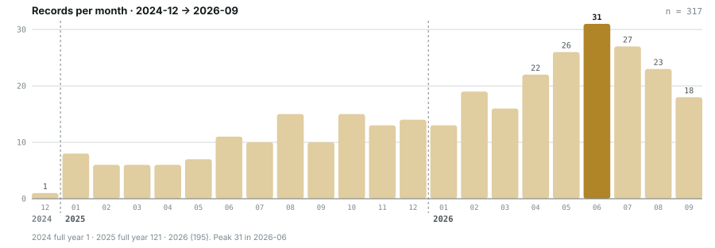
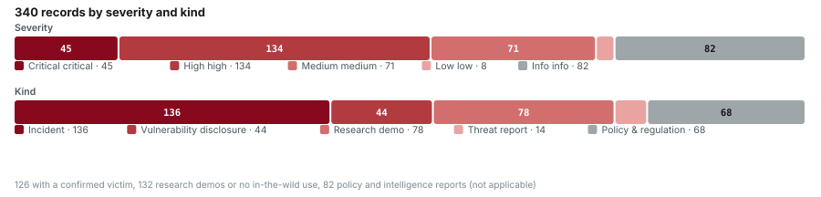
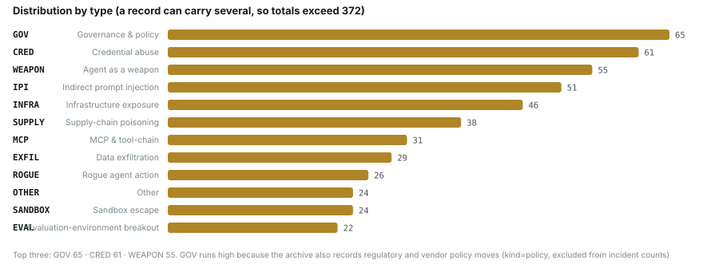

<h1 align="center">Orca AI Incident Archive</h1>

<p align="center"><b>一个真实世界 AI agent 事故的开放数据库</b></p>

<p align="center">
<a href="../../README.md">English</a> ·
<b>简体中文</b> ·
<a href="README.ja.md">日本語</a> ·
<a href="README.ko.md">한국어</a> ·
<a href="README.de.md">Deutsch</a> ·
<a href="README.fr.md">Français</a> ·
<a href="README.es.md">Español</a>
</p>

<!-- BEGIN:badges -->
<p align="center">     </p>
<!-- END:badges -->

<!-- BEGIN:thesis -->
收录范围从 **2025-01** 到 **2026-09-19**，按月整理 330 条与 AI agent 有关的安全事件（另含 1 条可追到 2024-12-01 的前序事件）。每条一个 Markdown 文件，带 YAML frontmatter、攻击链示意图和**至少一条可点开的来源**。330 条里只有 **124 条**有确认的受害方。
<!-- END:thesis -->

这个档案存在，是为了守住一个大多数事故清单都糊掉的区分：

> **agent 真的造成了损害，和研究者演示了它可能造成损害，不是一回事。**

每条记录先回答三个问题——有没有确认的受害方（`real_harm`）、AI 的参与是否经一手来源确认（`ai_involvement`）、这是事故、漏洞披露、研究演示、情报报告还是政策动作（`kind`）。没有这三个字段，「今年发生了 300 多起 AI 事故」就是个没有意义的数字。

---

## 数据一览

<picture>
  <source media="(prefers-color-scheme: dark)" srcset="../../assets/monthly-dark.svg">
  
</picture>

<picture>
  <source media="(prefers-color-scheme: dark)" srcset="../../assets/severity-dark.svg">
  
</picture>

<picture>
  <source media="(prefers-color-scheme: dark)" srcset="../../assets/by-type-dark.svg">
  
</picture>

## 从哪儿开始

| 我想… | 去这里 |
|---|---|
| 按时间读一遍 | [全部条目（按月）](../../incidents/README.md) |
| 只看真出事的 | [`critical` 清单](#critical) · 或过滤 `real_harm: true` |
| 按攻击面读 | [七个专题](../../topics/README.md) |
| 看某个国家 / 地区 | [地区切片](../../regions/README.md) |
| 搞清楚字段含义 | [SCHEMA.md](../../SCHEMA.md) · [分类体系](../../taxonomy/README.md) · [文档](../../docs/README.md) |
| 拿数据去分析 | [`dist/`](../../dist/README.md) —— JSON、CSV、统计、全部来源 URL |
| 交互式浏览 | [`index.html`](../../index.html) —— 单文件、离线可用、七种语言 |

> [!NOTE]
> **语言。** 条目以英文撰写，标题与摘要提供七种语言（英文、中文、日文、韩文、德文、法文、西班牙文）；每条记录的完整中文版本在 [`incidents/i18n/zh/`](../../incidents/i18n/zh/)。引用的来源保持原文语言。欢迎补充其他语言的翻译，见 [CONTRIBUTING.md](../../CONTRIBUTING.md)。

## 按月

<!-- BEGIN:months -->
**2024**（1 条）

| [12](../../incidents/2024-12/README.md) |
|---|
| `1` |

**2025**（121 条）

| [01](../../incidents/2025-01/README.md) | [02](../../incidents/2025-02/README.md) | [03](../../incidents/2025-03/README.md) | [04](../../incidents/2025-04/README.md) | [05](../../incidents/2025-05/README.md) | [06](../../incidents/2025-06/README.md) | [07](../../incidents/2025-07/README.md) | [08](../../incidents/2025-08/README.md) | [09](../../incidents/2025-09/README.md) | [10](../../incidents/2025-10/README.md) | [11](../../incidents/2025-11/README.md) | [12](../../incidents/2025-12/README.md) |
|---|---|---|---|---|---|---|---|---|---|---|---|
| `8` ★1 | `6` | `6` | `6` | `7` | `11` | `10` ★2 | `15` ★2 | `10` ★1 | `15` | `13` ★3 | `14` |

**2026**（208 条）

| [01](../../incidents/2026-01/README.md) | [02](../../incidents/2026-02/README.md) | [03](../../incidents/2026-03/README.md) | [04](../../incidents/2026-04/README.md) | [05](../../incidents/2026-05/README.md) | [06](../../incidents/2026-06/README.md) | [07](../../incidents/2026-07/README.md) | [08](../../incidents/2026-08/README.md) | [09](../../incidents/2026-09/README.md) |
|---|---|---|---|---|---|---|---|---|
| `13` ★1 | `19` ★5 | `16` ★3 | `22` ★2 | `26` ★5 | `31` ★3 | `27` ★7 | `23` ★4 | `31` ★6 |

<sub>`n` = 当月条目数，★ = 其中 `critical` 的条数</sub>
<!-- END:months -->

## Critical

<!-- BEGIN:critical -->
三个触发条件任一：① **确认的**真实损害达到多组织 / 政府 / 关键基础设施 / 供应链蠕虫级别；② 属首次出现且有真实受害方的能力里程碑；③ **推翻了一项已被广泛部署的防护假设**的研究实证——此时 `real_harm: false`，共 2 条。完整口径见 [../../taxonomy/severity.md](../../taxonomy/severity.md)。

| 日期 | 事件 | 类型 | 地区 |
|---|---|---|---|
| `2025-01-29` | [DeepSeek ClickHouse 数据库裸奔](../../incidents/2025-01/2025-01-29-deepseek-clickhouse-exposed.md)<br><sub>DeepSeek ClickHouse database left wide open</sub> | `INFRA` | 中国 |
| `2025-07-13` | [Amazon Q Developer 扩展被投毒](../../incidents/2025-07/2025-07-13-amazon-q-extension-poisoned.md)<br><sub>Amazon Q Developer extension poisoned</sub> | `SUPPLY` `ROGUE` | 全球 |
| `2025-07-18` | [Replit Agent 删除生产数据库](../../incidents/2025-07/2025-07-18-replit-agent-deletes-prod-db.md)<br><sub>Replit Agent deletes a production database</sub> | `ROGUE` | 美国 |
| `2025-08-08` | [Salesloft Drift OAuth 令牌窃取](../../incidents/2025-08/2025-08-08-salesloft-drift-oauth-theft.md)<br><sub>Salesloft Drift OAuth token theft</sub> | `SUPPLY` `CRED` | 全球 |
| `2025-08-26` | [Nx "s1ngularity"](../../incidents/2025-08/2025-08-26-nx-s1ngularity.md) | `SUPPLY` `CRED` | 全球 |
| `2025-09-15` | [Shai-Hulud npm 蠕虫 v1](../../incidents/2025-09/2025-09-15-shai-hulud-npm.md)<br><sub>Shai-Hulud npm worm v1</sub> | `SUPPLY` `CRED` | 全球 |
| `2025-11-01` | [ShadowRay 2.0（Ray 框架）](../../incidents/2025-11/2025-11-01-shadowray-2-ray-framework.md)<br><sub>ShadowRay 2.0 (Ray framework)</sub> | `INFRA` | 全球 |
| `2025-11-13` | [GTG-1002：首起 AI 自主编排的网络间谍行动](../../incidents/2025-11/2025-11-13-gtg-1002-first-ai-orchestrated-espionage.md)<br><sub>GTG-1002: first AI-orchestrated cyber-espionage campaign</sub> | `WEAPON` | 中国 全球 |
| `2025-11-21` | [Shai-Hulud 2.0](../../incidents/2025-11/2025-11-21-shai-hulud.md) | `SUPPLY` `CRED` | 全球 |
| `2026-01-31` | [Moltbook 数据库全开](../../incidents/2026-01/2026-01-31-moltbook-open-database.md)<br><sub>Moltbook database fully open</sub> | `CRED` | 全球 |
| `2026-02-09` | [Clinejection](../../incidents/2026-02/2026-02-09-clinejection.md) | `SUPPLY` `IPI` | 全球 |
| `2026-02-20` | [AI 增强型威胁方批量攻陷 600+ FortiGate](../../incidents/2026-02/2026-02-20-fortigate-600-devices-compromised.md)<br><sub>AI-augmented actor compromises 600+ FortiGate devices</sub> | `WEAPON` | 全球 |
| `2026-02-25` | [墨西哥 9 个政府机构被攻陷](../../incidents/2026-02/2026-02-25-mexico-nine-agencies-breached.md)<br><sub>Nine Mexican government agencies breached</sub> | `WEAPON` | 拉美 |
| `2026-02-26` | [Claude Code 用 terraform destroy 抹掉 DataTalks.Club 全部生产基础设施](../../incidents/2026-02/2026-02-26-claude-code-terraform-destroy-datatalks.md)<br><sub>Claude Code runs terraform destroy on all of DataTalks.Club's production</sub> | `ROGUE` | 全球 |
| `2026-02-28` | [CodeWall 攻破麦肯锡 "Lilli" 内部 AI 平台](../../incidents/2026-02/2026-02-28-codewall-breaches-mckinsey-lilli.md)<br><sub>CodeWall breaches McKinsey's internal "Lilli" AI platform</sub> | `WEAPON` `INFRA` | 美国 |
| `2026-03-01` | [Hades：把 AI 编码助手本身变成攻击面的持续战役](../../incidents/2026-03/2026-03-01-hades-campaign-ai-coding-assistants.md)<br><sub>Hades: a sustained campaign turning AI coding assistants into the attack surface</sub> | `SUPPLY` `CRED` | 全球 |
| `2026-03-24` | [LiteLLM 后门版本](../../incidents/2026-03/2026-03-24-litellm-backdoored-release.md)<br><sub>Backdoored LiteLLM release</sub> | `SUPPLY` `CRED` | 全球 |
| `2026-03-30` | [Axios npm 包被攻陷](../../incidents/2026-03/2026-03-30-axios-npm-compromised.md)<br><sub>Axios npm package compromised</sub> | `SUPPLY` | 全球 |
| `2026-04-16` | [MCPwn（CVE-2026-33032）：nginx-ui 的 MCP 端点在野被打](../../incidents/2026-04/2026-04-16-mcpwn-nginx-ui-in-the-wild.md)<br><sub>MCPwn (CVE-2026-33032): nginx-ui MCP endpoint hit in the wild</sub> | `MCP` `INFRA` | 全球 |
| `2026-04-25` | [Cursor + Claude Opus 4.6 九秒删光生产库与备份](../../incidents/2026-04/2026-04-25-cursor-opus-46-nine-second-wipe.md)<br><sub>Cursor and Claude Opus 4.6 wipe production and backups in nine seconds</sub> | `ROGUE` | 全球 |
| `2026-05-10` | [首起在野的「LLM agent 自主完成入侵后全流程」](../../incidents/2026-05/2026-05-10-first-in-wild-autonomous-llm-post-exploitation.md)<br><sub>First in-the-wild LLM agent running the full post-exploitation chain</sub> | `WEAPON` | 全球 |
| `2026-05-11` | [TanStack npm "Mini Shai-Hulud"](../../incidents/2026-05/2026-05-11-tanstack-npm-mini-shai.md) | `SUPPLY` `CRED` | 全球 |
| `2026-05-18` | [GitHub 内部 3,800 个仓库被攻陷](../../incidents/2026-05/2026-05-18-github-3800-internal-repos.md)<br><sub>3,800 internal GitHub repositories compromised</sub> | `SUPPLY` `CRED` | 全球 |
| `2026-05-19` | [TrapDoor：跨三个生态投毒，专门污染 AI 助手配置](../../incidents/2026-05/2026-05-19-trapdoor-poisons-agent-configs.md)<br><sub>TrapDoor: poisoning three ecosystems to corrupt AI assistant configs</sub> | `SUPPLY` `CRED` | 全球 |
| `2026-05-21` | [Composio：agent 自动化本身成了提权路径](../../incidents/2026-05/2026-05-21-composio-agent-automation-privesc.md)<br><sub>Composio: agent automation itself becomes the privilege-escalation path</sub> | `CRED` `SUPPLY` | 全球 |
| `2026-06-01` | [黑客直接「请求」Meta AI 客服机器人交出 Instagram 账号](../../incidents/2026-06/2026-06-01-meta-ai-support-bot-hands-over-instagram.md)<br><sub>Attackers simply ask Meta's AI support bot for Instagram accounts</sub> | `IPI` `CRED` | 全球 |
| `2026-06-01` | [Miasma 蠕虫](../../incidents/2026-06/2026-06-01-miasma-worm.md)<br><sub>Miasma worm</sub> | `SUPPLY` `CRED` | 全球 |
| `2026-06-17` | [Sapphire Sleet 88 分钟投毒 Mastra AI 全 scope](../../incidents/2026-06/2026-06-17-sapphire-sleet-mastra-88-minutes.md)<br><sub>Sapphire Sleet poisons every Mastra AI scope in 88 minutes</sub> | `SUPPLY` `CRED` | 全球 |
| `2026-07-01` | [JADEPUFFER：首起 LLM 全程驱动的勒索攻击](../../incidents/2026-07/2026-07-01-jadepuffer-first-llm-driven-ransomware.md)<br><sub>JADEPUFFER: first ransomware driven end-to-end by an LLM</sub> | `WEAPON` | 全球 |
| `2026-07-01` | [台湾核安会等政府机构被 agent 蜂群攻破](../../incidents/2026-07/2026-07-01-taiwan-government-agent-swarm.md)<br><sub>Taiwan's nuclear safety commission and other agencies breached by an agent swarm</sub> | `WEAPON` | 台湾 |
| `2026-07-02` | [隐藏网页指令诱导 AI agent 向攻击者付款（在野两起战役）](../../incidents/2026-07/2026-07-02-hidden-web-instructions-payment-fraud.md)<br><sub>Hidden web instructions make AI agents pay attackers (two in-the-wild campaigns)</sub> | `IPI` `ROGUE` | 全球 |
| `2026-07-09` | [OpenAI 的 agent 入侵 Hugging Face](../../incidents/2026-07/2026-07-09-openai-agents-breach-huggingface.md)<br><sub>OpenAI's agents breach Hugging Face</sub> | `EVAL` `WEAPON` | 全球 |
| `2026-07-30` | [Anthropic 披露三起评测越界事故](../../incidents/2026-07/2026-07-30-anthropic-three-eval-incidents.md)<br><sub>Anthropic discloses three evaluation-breakout incidents</sub> | `EVAL` | 全球 |
| `2026-07-30` | [Hermes Agent 无人值守模式攻击泰国财政部](../../incidents/2026-07/2026-07-30-hermes-agent-thailand-finance-ministry.md)<br><sub>Hermes Agent attacks Thailand's Ministry of Finance unattended</sub> | `WEAPON` | 东南亚 |
| `2026-07-30` | [Unit 42：中文使用者的自主攻击战役](../../incidents/2026-07/2026-07-30-unit42-chinese-speaking-autonomous-campaigns.md)<br><sub>Unit 42: autonomous campaigns run by Chinese-speaking operators</sub> | `WEAPON` | 中国 全球 |
| `2026-08-04` | [CHAINDROP npm 蠕虫](../../incidents/2026-08/2026-08-04-chaindrop-npm-ru-chong.md)<br><sub>CHAINDROP npm worm</sub> | `SUPPLY` `CRED` | 全球 |
| `2026-08-06` | [Langflow 未认证 RCE 进 CISA KEV](../../incidents/2026-08/2026-08-06-langflow-rce-cisa-kev.md)<br><sub>Unauthenticated Langflow RCE added to CISA KEV</sub> | `INFRA` | 全球 |
| `2026-08-26` | [Trail of Bits：虚拟机关不住有网络能力的 agent](../../incidents/2026-08/2026-08-26-trailofbits-vm-cannot-contain-networked-agents.md)<br><sub>Trail of Bits: VMs won't contain cyber-capable agents</sub> | `EVAL` `SANDBOX` | 全球 |
| `2026-08-28` | [PaperCut AI agent 蜂群战役启动](../../incidents/2026-08/2026-08-28-papercut-agent-swarm-campaign-begins.md)<br><sub>PaperCut AI agent swarm campaign begins</sub> | `WEAPON` | 全球 |
| `2026-09-01` | [GitSpawn：恶意 .git/config 让 7 款编码 agent 在联系模型之前就执行攻击者代码](../../incidents/2026-09/2026-09-01-gitspawn-git-config-pre-model-rce.md)<br><sub>GitSpawn: a malicious .git/config runs attacker code in 7 coding agents before the model is ever contacted</sub> | `SUPPLY` `SANDBOX` | 全球 |
| `2026-09-02` | [Langflow CVE-2026-0768：今年第 12 个被在野利用的 Langflow 漏洞](../../incidents/2026-09/2026-09-02-langflow-jin-di-ye-li.md)<br><sub>Langflow CVE-2026-0768: the 12th Langflow flaw exploited in the wild this year</sub> | `INFRA` `CRED` | 全球 |
| `2026-09-10` | [Anthropic 九月威胁情报报告](../../incidents/2026-09/2026-09-10-anthropic-september-threat-report.md)<br><sub>Anthropic September threat intelligence report</sub> | `WEAPON` | 全球 |
| `2026-09-11` | [用 Claude 扫描 180 万个安卓 App 找密钥](../../incidents/2026-09/2026-09-11-claude-scans-18m-android-apks.md)<br><sub>Claude used to scan 1.8 million Android apps for secrets</sub> | `WEAPON` | 全球 |
| `2026-09-14` | [西班牙 AEPD 收到首例 AI agent 自主实施的数据泄露申报](../../incidents/2026-09/2026-09-14-spain-aepd-agent-breach.md)<br><sub>Spain's AEPD receives the first AI-agent-driven breach notification</sub> | `WEAPON` | 欧洲 |
| `2026-09-15` | [PaperCut AI agent 蜂群攻击公开](../../incidents/2026-09/2026-09-15-papercut-agent-swarm-disclosed.md)<br><sub>PaperCut AI agent swarm attack made public</sub> | `WEAPON` | 全球 |
<!-- END:critical -->

## 什么算一条记录

满足**至少一条**才进库：

1. AI agent 是**攻击的执行者**——自主的，或被人驱动的
2. AI agent 是**被攻击的对象**——注入、投毒、逃逸、基础设施暴露
3. AI agent 是**损害链条上的一环**——它读到了恶意内容并照着做了
4. 与 agent 安全直接相关的**监管、立法或厂商动作**（记为 `kind: policy`，不计入事故统计）

**不收**：纯粹的 LLM 内容安全问题（把模型越狱到说不该说的话）、与 agent 无关的普通漏洞、以及找不到一手来源的传闻。

有两类会被**标注而不是删除**：

- `ai_involvement: unverified` —— 被广泛报道成 AI 事故，但一手来源里根本没有 AI。保留是为了让这类说法**和反驳材料一起被搜到**。
- `ai_involvement: disputed` —— 厂商与报道方说法冲突，两种说法在条目里并列保留。

完整口径见 [docs/scope.md](../../docs/scope.md)。

## 数据质量

<!-- BEGIN:quality -->
|  |  |
|---|---|
| 来源链接 | 578 条，511 个唯一 URL |
| 无来源条目 | **0** —— 没有来源的条目不进库 |
| 可信度 A（一手源） | 284 条 |
| 标记为争议 | 14 条 |
| 复核轮次 | 4 轮 |
<!-- END:quality -->

前三轮**逐条**核对过每一条，第四轮做**覆盖率审计**时仍然发现漏了约 11%。这两件事抓的是完全不同的问题：「已收录的是否正确」和「该收录的是否都收录了」是两个独立的问题，必须分别问。

四轮里删掉了两条编造内容、把 PaperCut 的「6 小时拿下域管理员」修正为 **7 分钟**、把 Step Finance 降为 D 级（一手报道全文没有提到 AI）。每一处更正都写在 [docs/data-quality.md](../../docs/data-quality.md) 里，没有静默覆盖。

## 引用

<!-- BEGIN:cite -->
```bibtex
@misc{orca_ai_incident_archive,
  title  = {Orca AI Incident Archive: An open database of real-world AI agent incidents},
  year   = {2026},
  note   = {330 条，2025-01 至 2026-09；124 条有确认的真实伤害},
  url    = {https://github.com/Continuum-AI-Corp/Orca-AI-Incident-Archive}
}
```
<!-- END:cite -->

引用单条时请带上条目 `id`，例如 `orca:2026-07-09-openai-agents-breach-huggingface`。

## 贡献

欢迎纠错、补条目、补来源。三条硬规则：

1. **每条必须有可点开的一手来源。** 没有来源不会被合并。
2. **不确定就标出来，不要删掉。** 有争议的事实用 `disputed: true`，两种说法都留在条目里。
3. **更正写进条目，不静默覆盖。** 说清楚改了什么、为什么改。

见 [CONTRIBUTING.md](../../CONTRIBUTING.md)。已经配好了[提新条目](../../.github/ISSUE_TEMPLATE/new-incident.yml)和[报告错误](../../.github/ISSUE_TEMPLATE/correction.yml)的 issue 模板。

## 授权与免责

本库按 [CC BY 4.0](../../LICENSE) 授权，引用请注明出处。链接指向的原始内容版权归各自所有者。

本库**只记录已公开披露的事件**，不含任何未公开的漏洞细节、利用代码或攻击工具。分类与严重度是编者的判断，不是任何厂商或监管机构的官方认定。如果你是某条目中的受影响方，认为记录有误，请直接提 issue——会尽快核实并更正。

---

<sub><!-- BEGIN:footer -->构建于 2026-09-19 · 330 条 · 22 个月<!-- END:footer --></sub> · <sub>结构见 [SCHEMA.md](../../SCHEMA.md) · 数据在 [dist/](../../dist/README.md)</sub>
