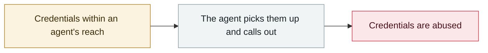

# Storm-2139 Azure OpenAI LLMjacking

     

## Summary

Microsoft's DCU filed suit in the Eastern District of Virginia in 2024-12 against 10 "John Doe" defendants; stolen credentials were used to take over Azure OpenAI, jailbreak techniques bypassed safeguards and the **service was resold**. The defendants were named publicly on 2025-02-27

## Attack chain

## Sources

| # | Source | Link |
|---|---|---|
| 1 | Microsoft | <https://blogs.microsoft.com/on-the-issues/2025/02/27/disrupting-cybercrime-abusing-gen-ai/> |

## Metadata

| Field | Value |
|---|---|
| Date | `2024-12-01` → `2025-02-01` (raw: 2024-12→2025-02, precision `month`) |
| Kind | Incident `incident` |
| Type | [`CRED`](../../taxonomy/types.md#cred) Credential abuse |
| Severity | **High** `high` |
| Confidence | **A** — primary source (vendor / victim / law enforcement / official report) |
| Real harm | Yes |
| AI involvement | Confirmed `confirmed` |
| Region | [Global](../../regions/global.md) |
| Archive ID | `2024-12-01-storm-azure-llmjacking` |

**Why this classification:** Real incident with a confirmed victim. Rated `high`: real damage is limited in scope, or it is a CVSS 9+ severe flaw, or a capability demonstration of significance. Grading criteria: see [taxonomy/severity.md](../../taxonomy/severity.md) and [taxonomy/confidence.md](../../taxonomy/confidence.md).

## Related

**Related records:**

- `2025-06-30` [McDonald's McHire "Olivia" hiring bot](../2025-06/2025-06-30-mcdonald-mchire-olivia.md)   McDonald's McHire "Olivia" hiring bot
- `2025-06-13` [Smithery.ai path traversal](../2025-06/2025-06-13-smithery-ai-lu-jing-chuan-yue.md)   Smithery.ai path traversal
- `2025-07-01` [RoguePilot](../2025-07/2025-07-01-roguepilot.md)   RoguePilot
- `2025-07-09` [McHire flaw goes public](../2025-07/2025-07-09-mchire-lou-dong-gong-kai.md)   McHire flaw goes public

---

[← 2024-12 index](README.md) · [← All records](../../README.md) · [Chinese](../i18n/zh/2024-12/2024-12-01-storm-azure-llmjacking.md)

This record is part of the **Orca AI Incident Archive**, licensed [CC BY 4.0](../../LICENSE). Found a factual error or a missing source? [Open an issue or PR](../../CONTRIBUTING.md) — corrections are recorded in the record's revision history, never silently overwritten.
