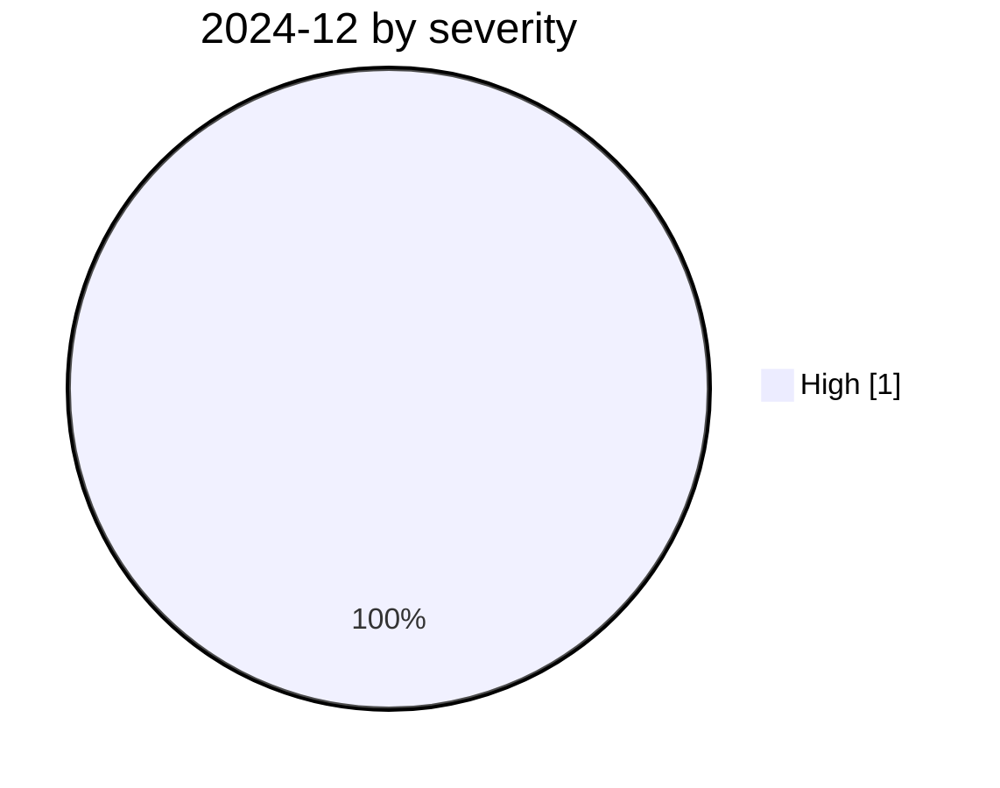

# 2024-12

<!-- BEGIN:summary -->
**1** records

 

## Records this month

| Date | Record | Type | Severity | Confidence | Real harm |
|---|---|---|---|---|---|
| `12-01` | [Storm-2139 Azure OpenAI LLMjacking](2024-12-01-storm-azure-llmjacking.md) | `CRED` | **High** | A | ✅ |

★ = `critical` · ⚠️ = disputed facts or attribution · real harm: ✅ confirmed victim / — none / · not applicable (policy and intelligence reports)
<!-- END:summary -->

<!-- BEGIN:nav -->
---

[Archive index](../../README.md) · [By type](../../taxonomy/types.md) · [2025-01 →](../2025-01/README.md)
<!-- END:nav -->
