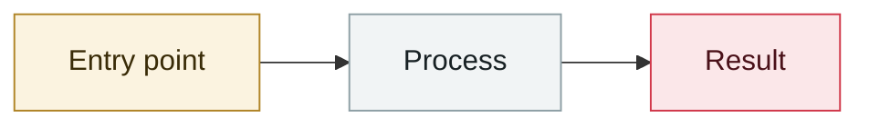

# AI phishing and deepfake voice hit a small Maine town

     

## Summary

Impersonating town officials to approve tens of thousands of dollars in payments

## Attack chain

## Sources

| # | Source | Link |
|---|---|---|
| 1 | OWASP Jan-Feb'25 | <https://genai.owasp.org/2025/03/06/owasp-gen-ai-incident-exploit-round-up-jan-feb-2025/> |

## Metadata

| Field | Value |
|---|---|
| Date | `2025-01-01` (raw: 2025-01, precision `month`) |
| Kind | Incident `incident` |
| Type | [`OTHER`](../../taxonomy/types.md#other) Other |
| Severity | **Medium** `medium` |
| Confidence | **A** — primary source (vendor / victim / law enforcement / official report) |
| Real harm | Yes |
| AI involvement | Confirmed `confirmed` |
| Region | [United States](../../regions/us.md) |
| Archive ID | `2025-01-01-maine-town-deepfake-phishing` |

**Why this classification:** Real incident with a confirmed victim. Rated `medium`: controlled demo, moderate flaw, or an incident limited to a single user / single machine. Grading criteria: see [taxonomy/severity.md](../../taxonomy/severity.md) and [taxonomy/confidence.md](../../taxonomy/confidence.md).

---

[← 2025-01 index](README.md) · [← All records](../../README.md) · [Chinese](../i18n/zh/2025-01/2025-01-01-maine-town-deepfake-phishing.md)

This record is part of the **Orca AI Incident Archive**, licensed [CC BY 4.0](../../LICENSE). Found a factual error or a missing source? [Open an issue or PR](../../CONTRIBUTING.md) — corrections are recorded in the record's revision history, never silently overwritten.
