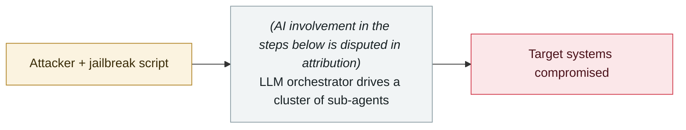

# Harbin Asian Winter Games systems attacked

     

> [!WARNING]
> **This record contains disputed or not fully confirmed facts**; the claims of each party are kept side by side in the body, so do not cite any single one of them in isolation.
> **AI involvement is disputed in attribution**; vendors and outlets disagree, see "Metadata".
> **Confidence D** — key facts or attribution are disputed.

## Summary

National Computer Virus Emergency Response Center report: the Games information systems came under **270,167 attacks** from abroad, most of them sourced from the United States and the Netherlands. On 04-15 Harbin police issued wanted notices for three NSA/TAO officers (Katherine Wilson, Robert Snell, Stephen Johnson) and said two US universities took part. **The claim of "the first large-scale cyberattack carried out using AI agents" comes from Chinese media commentary; the official report says "possibly", and it has not been independently verified**

> [!NOTE]
> The "cyberattack" itself is backed by an official report; what is disputed is the "AI agents were used" layer. The archive keeps it so that the widely reposted claim of the "first state-level AI agent attack" can be found and read alongside the counter-evidence.

## Attack chain

## Sources

| # | Source | Link |
|---|---|---|
| 1 | Xinhua | <http://www.news.cn/sports/20250404/9b6d2457ca41488e87ddbe494c2e3ee1/c.html> |
| 2 | Sina Finance (AI agent claim) | <https://finance.sina.com.cn/jjxw/2025-04-15/doc-inethkcn7574036.shtml> |
| 3 | Foreign Ministry response | <https://us.china-embassy.gov.cn/chn/zmgx_1/zxxx/202504/t20250404_11588749.htm> |

## Metadata

| Field | Value |
|---|---|
| Date | `2025-01-26` → `2025-02-14` (raw: 2025-01-26→02-14, precision `day`) |
| Kind | Incident `incident` |
| Type | [`WEAPON`](../../taxonomy/types.md#weapon) Agent used as a weapon |
| Severity | **High** `high` |
| Confidence | **D** — key facts or attribution disputed |
| Real harm | Yes |
| AI involvement | Disputed `disputed` |
| Region | [China](../../regions/cn.md) |
| Archive ID | `2025-01-26-harbin-asian-winter-games-attack` |

**Why this classification:** Real incident with a confirmed victim. Rated `high`: real damage is limited in scope, or it is a CVSS 9+ severe flaw, or a capability demonstration of significance. Grading criteria: see [taxonomy/severity.md](../../taxonomy/severity.md) and [taxonomy/confidence.md](../../taxonomy/confidence.md).

## Related

**Topic:** [Offensive AI capability evolution](../../topics/offensive-ai.md)

**Related records:**

- `2025-04-24` [Anthropic's first misuse report](../2025-04/2025-04-24-anthropic-shou-fen-lan-yong.md)   Anthropic's first misuse report
- `2025-05-01` [Anthropic logs the start of GTG-2002 activity](../2025-05/2025-05-01-anthropic-gtg-ji-lu-huo.md)   Anthropic logs the start of GTG-2002 activity
- `2025-05-01` [AI-driven credential stuffing and scanning goes to scale](../2025-05/2025-05-01-qu-dong-zhuang-ku-zi.md)   AI-driven credential stuffing and scanning goes to scale
- `2025-06-01` [Check Point's "Skynet" sample](../2025-06/2025-06-01-check-point-skynet.md)   Check Point's "Skynet" sample

---

[← 2025-01 index](README.md) · [← All records](../../README.md) · [Chinese](../i18n/zh/2025-01/2025-01-26-harbin-asian-winter-games-attack.md)

This record is part of the **Orca AI Incident Archive**, licensed [CC BY 4.0](../../LICENSE). Found a factual error or a missing source? [Open an issue or PR](../../CONTRIBUTING.md) — corrections are recorded in the record's revision history, never silently overwritten.
