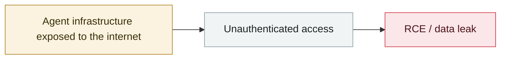

# DeepSeek ClickHouse database left wide open

     

## Summary

Wiz found unauthenticated public ClickHouse instances (`oauth2callback.deepseek.com:9000`, `dev.deepseek.com:9000`) where the `/play` path allowed running arbitrary SQL. The `log_stream` table held **over 1M log entries** (earliest 2025-01-06) with plaintext chat records, API keys and backend details. DeepSeek shut it down quickly after the report

## Attack chain

## Sources

| # | Source | Link |
|---|---|---|
| 1 | Wiz | <https://www.wiz.io/blog/wiz-research-uncovers-exposed-deepseek-database-leak> |
| 2 | THN | <https://thehackernews.com/2025/01/deepseek-ai-database-exposed-over-1.html> |

## Metadata

| Field | Value |
|---|---|
| Date | `2025-01-29` (raw: 2025-01-29, precision `day`) |
| Kind | Incident `incident` |
| Type | [`INFRA`](../../taxonomy/types.md#infra) Agent infrastructure exposure |
| Severity | **Critical** `critical` |
| Confidence | **A** — primary source (vendor / victim / law enforcement / official report) |
| Real harm | Yes |
| AI involvement | Confirmed `confirmed` |
| Region | [China](../../regions/cn.md) |
| Archive ID | `2025-01-29-deepseek-clickhouse-exposed` |

**Why this classification:** Real incident with a confirmed victim. Rated `critical`: confirmed real damage at the multi-organization / government / critical-infrastructure / supply-chain-worm level, or a first-of-its-kind capability milestone with real victims. Grading criteria: see [taxonomy/severity.md](../../taxonomy/severity.md) and [taxonomy/confidence.md](../../taxonomy/confidence.md).

## Related

**Topic:** [Agent infrastructure exposure](../../topics/agent-infra.md)

**Related records:**

- `2025-02-01` [Thousands of Ollama servers exposed without auth](../2025-02/2025-02-01-ollama-fu-wu-qi-gui.md)   Thousands of Ollama servers exposed without auth
- `2025-03-01` [ChatGPT SSRF CVE-2024-27564 exploited in the wild](../2025-03/2025-03-01-chatgpt-ssrf-ye-li-yong.md)   ChatGPT SSRF CVE-2024-27564 exploited in the wild
- `2025-03-03` [DeepSeek exposure window closes](../2025-03/2025-03-03-deepseek-bao-lu-chuang-kou.md)   DeepSeek exposure window closes
- `2025-04-29` [NVIDIA TensorRT-LLM deserialization RCE](../2025-04/2025-04-29-nvidia-tensorrt-llm-rce.md)   NVIDIA TensorRT-LLM deserialization RCE

---

[← 2025-01 index](README.md) · [← All records](../../README.md) · [Chinese](../i18n/zh/2025-01/2025-01-29-deepseek-clickhouse-exposed.md)

This record is part of the **Orca AI Incident Archive**, licensed [CC BY 4.0](../../LICENSE). Found a factual error or a missing source? [Open an issue or PR](../../CONTRIBUTING.md) — corrections are recorded in the record's revision history, never silently overwritten.
