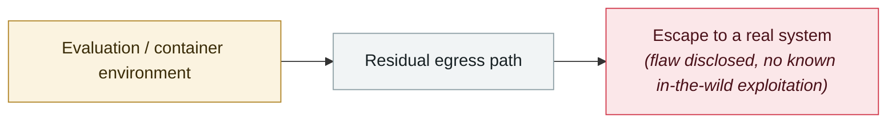

# Two GitHub Copilot flaws

     

## Summary

① an "affirmation jailbreak" (bypassing ethical filters with agreeable phrasing) ② proxy-token interception to freeload on OpenAI's premium models

## Attack chain

## Sources

| # | Source | Link |
|---|---|---|
| 1 | OWASP Jan-Feb'25 | <https://genai.owasp.org/2025/03/06/owasp-gen-ai-incident-exploit-round-up-jan-feb-2025/> |

## Metadata

| Field | Value |
|---|---|
| Date | `2025-01-31` (raw: 2025-01-31, precision `day`) |
| Kind | Vulnerability disclosure `vulnerability` |
| Type | [`SANDBOX`](../../taxonomy/types.md#sandbox) Sandbox escape |
| Severity | **Medium** `medium` |
| Confidence | **B** — research lab or major outlet with checkable detail |
| Real harm | No |
| AI involvement | Confirmed `confirmed` |
| Region | [Global](../../regions/global.md) |
| Archive ID | `2025-01-31-github-copilot-shuang-lou-dong` |

**Why this classification:** Vulnerability disclosure; as of archiving there is no evidence of in-the-wild exploitation, so `real_harm: false`. Rated `medium`: controlled demo, moderate flaw, or an incident limited to a single user / single machine. Grading criteria: see [taxonomy/severity.md](../../taxonomy/severity.md) and [taxonomy/confidence.md](../../taxonomy/confidence.md).

## Related

**Topic:** [Frontier model autonomous overreach](../../topics/eval-escapes.md)

**Related records:**

- `2025-03-01` [Manus AI leaks in-sandbox prompts and runtime code](../2025-03/2025-03-01-manus-sha-xiang-nei-ti.md)   Manus AI leaks in-sandbox prompts and runtime code
- `2025-07-21` [Claude Code hooks RCE](../2025-07/2025-07-21-claude-code-hooks-rce.md)   Claude Code hooks RCE
- `2025-07-28` [Gemini CLI silent code execution](../2025-07/2025-07-28-gemini-cli-jing-mo-dai.md)   Gemini CLI silent code execution
- `2025-08-01` [Cursor CurXecute (CVE-2025-54135)](../2025-08/2025-08-01-cursor-curxecute.md)   Cursor CurXecute (CVE-2025-54135)

---

[← 2025-01 index](README.md) · [← All records](../../README.md) · [Chinese](../i18n/zh/2025-01/2025-01-31-github-copilot-shuang-lou-dong.md)

This record is part of the **Orca AI Incident Archive**, licensed [CC BY 4.0](../../LICENSE). Found a factual error or a missing source? [Open an issue or PR](../../CONTRIBUTING.md) — corrections are recorded in the record's revision history, never silently overwritten.
