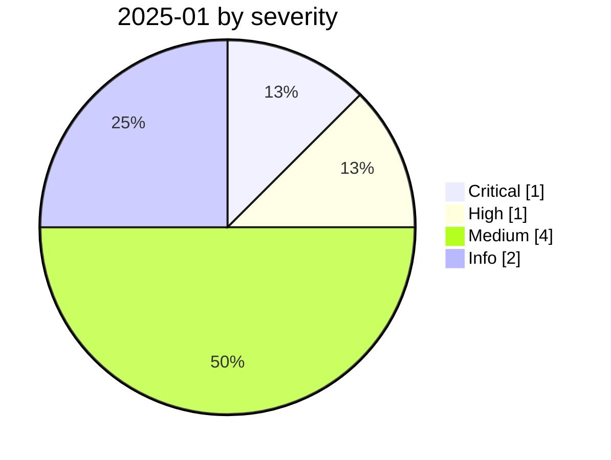

# 2025-01

<!-- BEGIN:summary -->
**8** records

    

## Records this month

| Date | Record | Type | Severity | Confidence | Real harm |
|---|---|---|---|---|---|
| `01-01` | [AI phishing and deepfake voice hit a small Maine town](2025-01-01-maine-town-deepfake-phishing.md) | `OTHER` | Medium | A | ✅ |
| `01-20` | [Hong Kong AI voice-clone crypto fraud](2025-01-20-hk-voice-clone-usdt-fraud.md) | `OTHER` | Medium | A | ✅ |
| `01-23` | [OpenAI Operator launches (context entry)](2025-01-23-operator-fa-bu-bei-jing.md) | `GOV` | Info | A | · |
| `01-26` | [Harbin Asian Winter Games systems attacked](2025-01-26-harbin-asian-winter-games-attack.md) ⚠️ | `WEAPON` | **High** | D | ✅ |
| `01-27` | [DeepSeek hit by large-scale attacks, halts signups](2025-01-27-deepseek-zao-gui-mo-gong.md) | `OTHER` | Medium | B | ✅ |
| `01-29` | ★ [DeepSeek ClickHouse database left wide open](2025-01-29-deepseek-clickhouse-exposed.md) | `INFRA` | **Critical** | A | ✅ |
| `01-30` | [Italy's Garante blocks DeepSeek](2025-01-30-garante-deepseek-yi-li-feng.md) | `GOV` | Info | A | · |
| `01-31` | [Two GitHub Copilot flaws](2025-01-31-github-copilot-shuang-lou-dong.md) | `SANDBOX` | Medium | B | — |

★ = `critical` · ⚠️ = disputed facts or attribution · real harm: ✅ confirmed victim / — none / · not applicable (policy and intelligence reports)
<!-- END:summary -->

<!-- BEGIN:nav -->
---

[← 2024-12](../2024-12/README.md) · [Archive index](../../README.md) · [By type](../../taxonomy/types.md) · [2025-02 →](../2025-02/README.md)
<!-- END:nav -->
