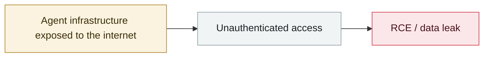

# Thousands of Ollama servers exposed without auth

     

> [!WARNING]
> **This record contains disputed or not fully confirmed facts**; the claims of each party are kept side by side in the body, so do not cite any single one of them in isolation.

## Summary

QiAnXin Hunter: of **8,971** Ollama servers worldwide, **6,449 are active**, and **88.9% have no effective security protection**; **5,669 of the 8,971 are in China**. There is no authentication by default (port 11434), so models can be stolen, false information fed in, inference capacity hijacked or deployed DeepSeek/Qwen model files even deleted. CNVD-2025-04094

## Attack chain

## Sources

| # | Source | Link |
|---|---|---|
| 1 | QiAnXin | <https://www.qianxin.com/news/detail?news_id=13062> |
| 2 | CNCERT advisory | <https://www.secrss.com/articles/76168> |
| 3 | NSFOCUS | <https://blog.nsfocus.net/cnvd-2025-04094/> |

## Metadata

| Field | Value |
|---|---|
| Date | `2025-02-01` (raw: 2025-02, precision `month`) |
| Kind | Incident `incident` |
| Type | [`INFRA`](../../taxonomy/types.md#infra) Agent infrastructure exposure |
| Severity | **High** `high` |
| Confidence | **A** — primary source (vendor / victim / law enforcement / official report) |
| Real harm | Yes |
| AI involvement | Confirmed `confirmed` |
| Region | [China](../../regions/cn.md) · [Global](../../regions/global.md) |
| Archive ID | `2025-02-01-ollama-fu-wu-qi-gui` |

**Why this classification:** Real incident with a confirmed victim. Rated `high`: real damage is limited in scope, or it is a CVSS 9+ severe flaw, or a capability demonstration of significance. Grading criteria: see [taxonomy/severity.md](../../taxonomy/severity.md) and [taxonomy/confidence.md](../../taxonomy/confidence.md).

## Related

**Topic:** [Agent infrastructure exposure](../../topics/agent-infra.md)

**Related records:**

- `2025-01-29` [DeepSeek ClickHouse database left wide open](../2025-01/2025-01-29-deepseek-clickhouse-exposed.md)   DeepSeek ClickHouse database left wide open
- `2025-03-01` [ChatGPT SSRF CVE-2024-27564 exploited in the wild](../2025-03/2025-03-01-chatgpt-ssrf-ye-li-yong.md)   ChatGPT SSRF CVE-2024-27564 exploited in the wild
- `2025-03-03` [DeepSeek exposure window closes](../2025-03/2025-03-03-deepseek-bao-lu-chuang-kou.md)   DeepSeek exposure window closes
- `2025-04-29` [NVIDIA TensorRT-LLM deserialization RCE](../2025-04/2025-04-29-nvidia-tensorrt-llm-rce.md)   NVIDIA TensorRT-LLM deserialization RCE

---

[← 2025-02 index](README.md) · [← All records](../../README.md) · [Chinese](../i18n/zh/2025-02/2025-02-01-ollama-fu-wu-qi-gui.md)

This record is part of the **Orca AI Incident Archive**, licensed [CC BY 4.0](../../LICENSE). Found a factual error or a missing source? [Open an issue or PR](../../CONTRIBUTING.md) — corrections are recorded in the record's revision history, never silently overwritten.
