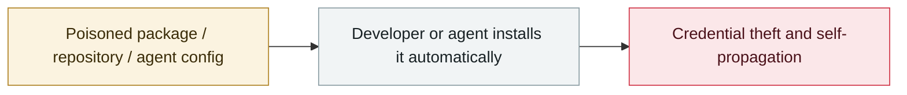

# Hugging Face "nullifAI" malicious models

     

## Summary

ReversingLabs found 2 malicious pickle models. The trick: PyTorch format but compressed with **7z instead of the default ZIP**, which stops `torch.load()` from loading them and thereby **evades Hugging Face's Picklescan detection**; they contain a reverse shell to a hardcoded IP

## Attack chain

## Sources

| # | Source | Link |
|---|---|---|
| 1 | ReversingLabs | <https://www.reversinglabs.com/press-releases/reversinglabs-identifies-novel-ml-malware-hosted-on-leading-hugging-face-ai-model-platform> |
| 2 | THN | <https://thehackernews.com/2025/02/malicious-ml-models-found-on-hugging.html> |

## Metadata

| Field | Value |
|---|---|
| Date | `2025-02-06` (raw: 2025-02-06, precision `day`) |
| Kind | Incident `incident` |
| Type | [`SUPPLY`](../../taxonomy/types.md#supply) Supply-chain poisoning |
| Severity | **High** `high` |
| Confidence | **A** — primary source (vendor / victim / law enforcement / official report) |
| Real harm | No |
| AI involvement | Confirmed `confirmed` |
| Region | [Global](../../regions/global.md) |
| Archive ID | `2025-02-06-hugging-face-nullifai` |

**Why this classification:** Real incident without a confirmed specific victim. Rated `high`: real damage is limited in scope, or it is a CVSS 9+ severe flaw, or a capability demonstration of significance. Grading criteria: see [taxonomy/severity.md](../../taxonomy/severity.md) and [taxonomy/confidence.md](../../taxonomy/confidence.md).

## Related

**Topic:** [Agent supply-chain poisoning](../../topics/agent-supply-chain.md)

**Related records:**

- `2025-03-18` [Cursor / Copilot "Rules File Backdoor"](../2025-03/2025-03-18-cursor-copilot-rules-file.md)   Cursor / Copilot "Rules File Backdoor"
- `2025-04-01` ["Slopsquatting" gets its name](../2025-04/2025-04-01-slopsquatting-gai-nian-cheng-xing.md)   "Slopsquatting" gets its name
- `2025-07-13` [Amazon Q Developer extension poisoned](../2025-07/2025-07-13-amazon-q-extension-poisoned.md)   Amazon Q Developer extension poisoned
- `2025-08-08` [Salesloft Drift OAuth token theft](../2025-08/2025-08-08-salesloft-drift-oauth-theft.md)   Salesloft Drift OAuth token theft

---

[← 2025-02 index](README.md) · [← All records](../../README.md) · [Chinese](../i18n/zh/2025-02/2025-02-06-hugging-face-nullifai.md)

This record is part of the **Orca AI Incident Archive**, licensed [CC BY 4.0](../../LICENSE). Found a factual error or a missing source? [Open an issue or PR](../../CONTRIBUTING.md) — corrections are recorded in the record's revision history, never silently overwritten.
