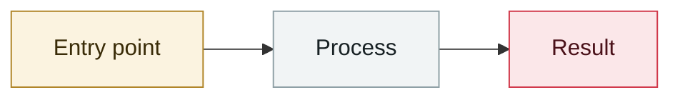

# OmniGPT data leak (claimed)

     

## Summary

Someone using the handle "Gloomer" posted samples on BreachForums, claiming 30,000 users' emails/phones plus **34 million lines of chat logs** with API keys, credentials and billing data. OmniGPT is an intermediary that aggregates GPT-4o/Claude 3.5/Gemini. **The platform has not confirmed it**; strictly speaking this is an aggregator rather than an agent, a borderline entry

## Attack chain

## Sources

| # | Source | Link |
|---|---|---|
| 1 | SiliconANGLE | <https://siliconangle.com/2025/02/12/ai-aggregator-omnigpt-reportedly-breached-sensitive-user-data-leaked-online/> |
| 2 | HackRead | <https://hackread.com/omnigpt-ai-chatbot-breach-hacker-leak-user-data-messages/> |

## Metadata

| Field | Value |
|---|---|
| Date | `2025-02-11` (raw: 2025-02-11, precision `day`) |
| Kind | Incident `incident` |
| Type | [`OTHER`](../../taxonomy/types.md#other) Other |
| Severity | **Medium** `medium` |
| Confidence | **B** — research lab or major outlet with checkable detail |
| Real harm | Yes |
| AI involvement | Confirmed `confirmed` |
| Region | [Global](../../regions/global.md) |
| Archive ID | `2025-02-11-omnigpt-shu-ju-xie-lu` |

**Why this classification:** Real incident with a confirmed victim. Rated `medium`: controlled demo, moderate flaw, or an incident limited to a single user / single machine. Grading criteria: see [taxonomy/severity.md](../../taxonomy/severity.md) and [taxonomy/confidence.md](../../taxonomy/confidence.md).

---

[← 2025-02 index](README.md) · [← All records](../../README.md) · [Chinese](../i18n/zh/2025-02/2025-02-11-omnigpt-shu-ju-xie-lu.md)

This record is part of the **Orca AI Incident Archive**, licensed [CC BY 4.0](../../LICENSE). Found a factual error or a missing source? [Open an issue or PR](../../CONTRIBUTING.md) — corrections are recorded in the record's revision history, never silently overwritten.
