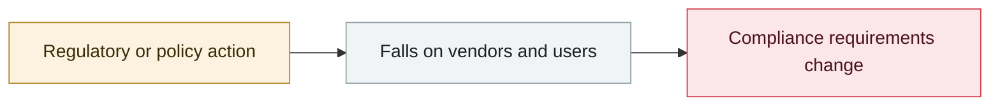

# Microsoft sues Storm-2139 and names the defendants

     

## Summary

Microsoft's complaint publicly names 4 core members of Storm-2139, a group that abused stolen Azure OpenAI credentials and resold generated content that bypassed content safety.

## Attack chain

## Sources

| # | Source | Link |
|---|---|---|
| 1 | Microsoft | <https://blogs.microsoft.com/on-the-issues/2025/02/27/disrupting-cybercrime-abusing-gen-ai/> |

## Metadata

| Field | Value |
|---|---|
| Date | `2025-02-27` (raw: 2025-02-27, precision `day`) |
| Kind | Policy & regulation `policy` |
| Type | [`GOV`](../../taxonomy/types.md#gov) Governance & policy |
| Severity | **Info** `info` |
| Confidence | **A** — primary source (vendor / victim / law enforcement / official report) |
| Real harm | n/a |
| AI involvement | Confirmed `confirmed` |
| Region | [United States](../../regions/us.md) |
| Archive ID | `2025-02-27-storm-wei-ruan-qi-su` |

**Why this classification:** Policy / regulatory action, not counted in incident statistics; `severity` is recorded as `info`. Grading criteria: see [taxonomy/severity.md](../../taxonomy/severity.md) and [taxonomy/confidence.md](../../taxonomy/confidence.md).

## Related

**Topic:** [Defense & governance](../../topics/defense.md)

**Related records:**

- `2025-02-21` [OpenAI bans accounts behind the "Peer Review" surveillance tool](2025-02-21-peer-review-feng-jin-jian.md)   OpenAI bans accounts behind the "Peer Review" surveillance tool
- `2025-01-30` [Italy's Garante blocks DeepSeek](../2025-01/2025-01-30-garante-deepseek-yi-li-feng.md)   Italy's Garante blocks DeepSeek
- `2025-01-23` [OpenAI Operator launches (context entry)](../2025-01/2025-01-23-operator-fa-bu-bei-jing.md)   OpenAI Operator launches (context entry)
- `2025-03-01` [Sony pulls 75,000+ AI deepfake tracks](../2025-03/2025-03-01-sony-jia-wan-shen-wei.md)   Sony pulls 75,000+ AI deepfake tracks

---

[← 2025-02 index](README.md) · [← All records](../../README.md) · [Chinese](../i18n/zh/2025-02/2025-02-27-storm-wei-ruan-qi-su.md)

This record is part of the **Orca AI Incident Archive**, licensed [CC BY 4.0](../../LICENSE). Found a factual error or a missing source? [Open an issue or PR](../../CONTRIBUTING.md) — corrections are recorded in the record's revision history, never silently overwritten.
