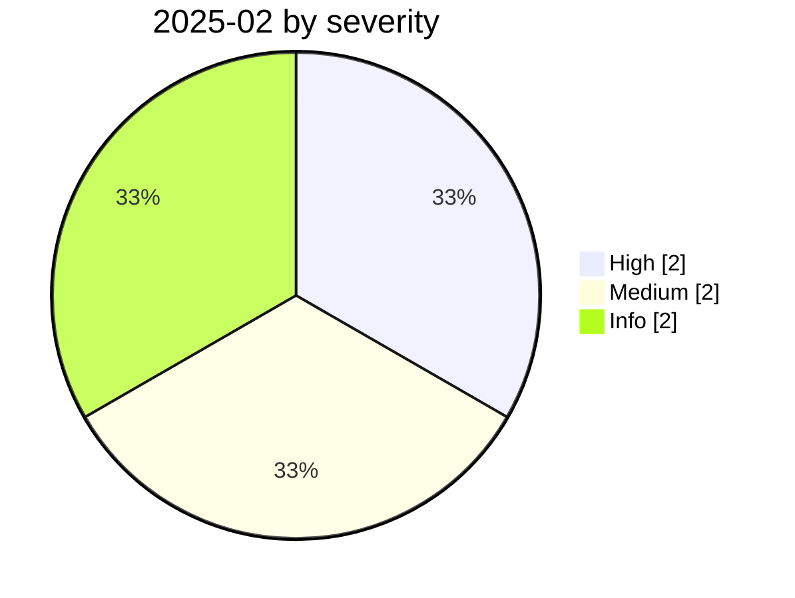

# 2025-02

<!-- BEGIN:summary -->
**6** records

   

## Records this month

| Date | Record | Type | Severity | Confidence | Real harm |
|---|---|---|---|---|---|
| `02-01` | [Thousands of Ollama servers exposed without auth](2025-02-01-ollama-fu-wu-qi-gui.md) ⚠️ | `INFRA` | **High** | A | ✅ |
| `02-06` | [Hugging Face "nullifAI" malicious models](2025-02-06-hugging-face-nullifai.md) | `SUPPLY` | **High** | A | — |
| `02-11` | [OmniGPT data leak (claimed)](2025-02-11-omnigpt-shu-ju-xie-lu.md) | `OTHER` | Medium | B | ✅ |
| `02-21` | [OpenAI bans accounts behind the "Peer Review" surveillance tool](2025-02-21-peer-review-feng-jin-jian.md) | `GOV` | Info | A | · |
| `02-25` | [Chain-of-thought jailbreak](2025-02-25-cot-jailbreak-si-wei-lian.md) | `OTHER` | Medium | A | — |
| `02-27` | [Microsoft sues Storm-2139 and names the defendants](2025-02-27-storm-wei-ruan-qi-su.md) | `GOV` | Info | A | · |

★ = `critical` · ⚠️ = disputed facts or attribution · real harm: ✅ confirmed victim / — none / · not applicable (policy and intelligence reports)
<!-- END:summary -->

<!-- BEGIN:nav -->
---

[← 2025-01](../2025-01/README.md) · [Archive index](../../README.md) · [By type](../../taxonomy/types.md) · [2025-03 →](../2025-03/README.md)
<!-- END:nav -->
