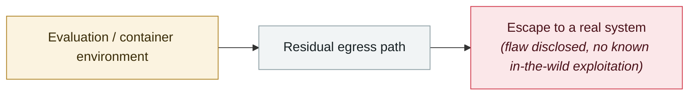

# Manus AI leaks in-sandbox prompts and runtime code

     

## Summary

A user only had to ask Manus to print the contents of an internal directory (such as `/opt/.manus/`) to get back parts of the system prompt and runtime code. Co-founder and chief scientist Peak Ji responded that **users could already access the sandbox directly**, that each session's sandbox is isolated, that the code inside the sandbox only receives instructions and was therefore only lightly obfuscated, and that the tool was never designed to be secret.

💡 Why it is listed: this is a rare first-half-2025 example of a **boundary issue in a Chinese agent product itself**, and the vendor's response treats "the sandbox is accessible" as a design premise — the same risk model that later appeared with OpenClaw

## Attack chain

## Sources

| # | Source | Link |
|---|---|---|
| 1 | AIBase | <https://www.aibase.com/news/16138> |

## Metadata

| Field | Value |
|---|---|
| Date | `2025-03-01` (raw: 2025-03, precision `month`) |
| Kind | Vulnerability disclosure `vulnerability` |
| Type | [`SANDBOX`](../../taxonomy/types.md#sandbox) Sandbox escape |
| Severity | **Medium** `medium` |
| Confidence | **B** — research lab or major outlet with checkable detail |
| Real harm | No |
| AI involvement | Confirmed `confirmed` |
| Region | [China](../../regions/cn.md) |
| Archive ID | `2025-03-01-manus-sha-xiang-nei-ti` |

**Why this classification:** Vulnerability disclosure; as of archiving there is no evidence of in-the-wild exploitation, so `real_harm: false`. Rated `medium`: controlled demo, moderate flaw, or an incident limited to a single user / single machine. Grading criteria: see [taxonomy/severity.md](../../taxonomy/severity.md) and [taxonomy/confidence.md](../../taxonomy/confidence.md).

## Related

**Topic:** [Frontier model autonomous overreach](../../topics/eval-escapes.md)

**Related records:**

- `2025-01-31` [Two GitHub Copilot flaws](../2025-01/2025-01-31-github-copilot-shuang-lou-dong.md)   Two GitHub Copilot flaws
- `2025-07-21` [Claude Code hooks RCE](../2025-07/2025-07-21-claude-code-hooks-rce.md)   Claude Code hooks RCE
- `2025-07-28` [Gemini CLI silent code execution](../2025-07/2025-07-28-gemini-cli-jing-mo-dai.md)   Gemini CLI silent code execution
- `2025-08-01` [Cursor CurXecute (CVE-2025-54135)](../2025-08/2025-08-01-cursor-curxecute.md)   Cursor CurXecute (CVE-2025-54135)

---

[← 2025-03 index](README.md) · [← All records](../../README.md) · [Chinese](../i18n/zh/2025-03/2025-03-01-manus-sha-xiang-nei-ti.md)

This record is part of the **Orca AI Incident Archive**, licensed [CC BY 4.0](../../LICENSE). Found a factual error or a missing source? [Open an issue or PR](../../CONTRIBUTING.md) — corrections are recorded in the record's revision history, never silently overwritten.
