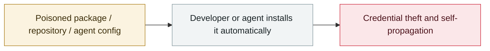

# Cursor / Copilot "Rules File Backdoor"

     

## Summary

Pillar Security disclosed that **invisible Unicode characters** can be embedded in `.cursorrules`, `.cursor/rules/` and `.github/copilot-instructions.md` — blank to the human eye but fully readable by the model. The instructions make the model inject backdoors, hardcoded credentials or exfiltration code into every suggestion, **and this stays invisible in PR review**. Cursor was notified in 2025-02 and GitHub in 03; **Cursor responded that it is not a platform vulnerability and that users should manage the risk themselves**; GitHub shipped a hidden-Unicode warning on 2025-05-01

## Attack chain

## Sources

| # | Source | Link |
|---|---|---|
| 1 | Pillar Security | <https://www.pillar.security/blog/new-vulnerability-in-github-copilot-and-cursor-how-hackers-can-weaponize-code-agents> |
| 2 | SC Media | <https://www.scworld.com/news/how-ai-coding-assistants-could-be-compromised-via-rules-file> |

## Metadata

| Field | Value |
|---|---|
| Date | `2025-03-18` (raw: 2025-03-18, precision `day`) |
| Kind | Incident `incident` |
| Type | [`SUPPLY`](../../taxonomy/types.md#supply) Supply-chain poisoning |
| Severity | **High** `high` |
| Confidence | **A** — primary source (vendor / victim / law enforcement / official report) |
| Real harm | No |
| AI involvement | Confirmed `confirmed` |
| Region | [Global](../../regions/global.md) |
| Archive ID | `2025-03-18-cursor-copilot-rules-file` |

**Why this classification:** Real incident without a confirmed specific victim. Rated `high`: real damage is limited in scope, or it is a CVSS 9+ severe flaw, or a capability demonstration of significance. Grading criteria: see [taxonomy/severity.md](../../taxonomy/severity.md) and [taxonomy/confidence.md](../../taxonomy/confidence.md).

## Related

**Topic:** [Agent supply-chain poisoning](../../topics/agent-supply-chain.md)

**Related records:**

- `2025-02-06` [Hugging Face "nullifAI" malicious models](../2025-02/2025-02-06-hugging-face-nullifai.md)   Hugging Face "nullifAI" malicious models
- `2025-04-01` ["Slopsquatting" gets its name](../2025-04/2025-04-01-slopsquatting-gai-nian-cheng-xing.md)   "Slopsquatting" gets its name
- `2025-07-13` [Amazon Q Developer extension poisoned](../2025-07/2025-07-13-amazon-q-extension-poisoned.md)   Amazon Q Developer extension poisoned
- `2025-08-08` [Salesloft Drift OAuth token theft](../2025-08/2025-08-08-salesloft-drift-oauth-theft.md)   Salesloft Drift OAuth token theft

---

[← 2025-03 index](README.md) · [← All records](../../README.md) · [Chinese](../i18n/zh/2025-03/2025-03-18-cursor-copilot-rules-file.md)

This record is part of the **Orca AI Incident Archive**, licensed [CC BY 4.0](../../LICENSE). Found a factual error or a missing source? [Open an issue or PR](../../CONTRIBUTING.md) — corrections are recorded in the record's revision history, never silently overwritten.
