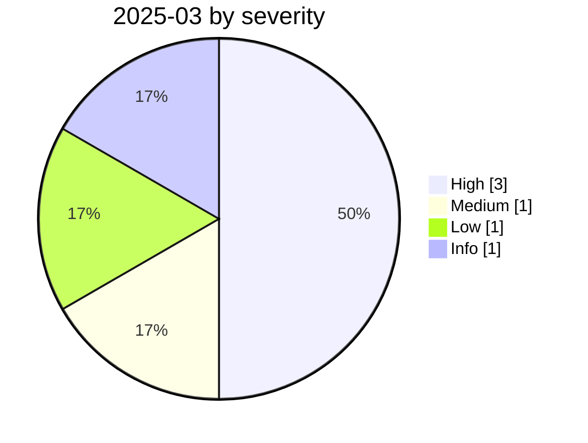

# 2025-03

<!-- BEGIN:summary -->
**6** records

    

## Records this month

| Date | Record | Type | Severity | Confidence | Real harm |
|---|---|---|---|---|---|
| `03-01` | [ChatGPT SSRF CVE-2024-27564 exploited in the wild](2025-03-01-chatgpt-ssrf-ye-li-yong.md) | `INFRA` | **High** | B | ✅ |
| `03-01` | [Deepfake voice defeats bank voiceprint auth in HK and Singapore](2025-03-01-hk-sg-bank-deepfake-voiceprint.md) | `OTHER` | **High** | A | ✅ |
| `03-01` | [Manus AI leaks in-sandbox prompts and runtime code](2025-03-01-manus-sha-xiang-nei-ti.md) | `SANDBOX` | Medium | B | — |
| `03-01` | [Sony pulls 75,000+ AI deepfake tracks](2025-03-01-sony-jia-wan-shen-wei.md) | `GOV` | Info | A | · |
| `03-03` | [DeepSeek exposure window closes](2025-03-03-deepseek-bao-lu-chuang-kou.md) | `INFRA` | Low | A | — |
| `03-18` | [Cursor / Copilot "Rules File Backdoor"](2025-03-18-cursor-copilot-rules-file.md) | `SUPPLY` | **High** | A | — |

★ = `critical` · ⚠️ = disputed facts or attribution · real harm: ✅ confirmed victim / — none / · not applicable (policy and intelligence reports)
<!-- END:summary -->

<!-- BEGIN:nav -->
---

[← 2025-02](../2025-02/README.md) · [Archive index](../../README.md) · [By type](../../taxonomy/types.md) · [2025-04 →](../2025-04/README.md)
<!-- END:nav -->
