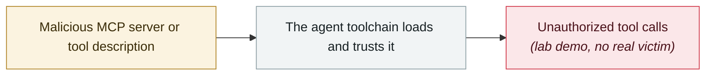

# GPT-4.1 jailbroken through a poisoned MCP tool

     

## Summary

Researchers jailbroke GPT-4.1 with a poisoned MCP tool description, making it access and exfiltrate unauthorized data without the user noticing.

## Attack chain

## Sources

| # | Source | Link |
|---|---|---|
| 1 | OWASP Q2'25 | <https://genai.owasp.org/2025/07/14/owasp-gen-ai-incident-exploit-round-up-q225/> |

## Metadata

| Field | Value |
|---|---|
| Date | `2025-04-01` (raw: 2025-04, precision `month`) |
| Kind | Research demo `research` |
| Type | [`MCP`](../../taxonomy/types.md#mcp) MCP & tool-chain |
| Severity | **Medium** `medium` |
| Confidence | **A** — primary source (vendor / victim / law enforcement / official report) |
| Real harm | No |
| AI involvement | Confirmed `confirmed` |
| Region | [Global](../../regions/global.md) |
| Archive ID | `2025-04-01-gpt-mcp-jing-gong-ju` |

**Why this classification:** Controlled demo by a research lab or vendor, `real_harm: false`; the record marks when the attack surface became public. Rated `medium`: controlled demo, moderate flaw, or an incident limited to a single user / single machine. Grading criteria: see [taxonomy/severity.md](../../taxonomy/severity.md) and [taxonomy/confidence.md](../../taxonomy/confidence.md).

## Related

**Topic:** [Agent supply-chain poisoning](../../topics/agent-supply-chain.md)

**Related records:**

- `2025-04-01` [First systematic disclosure of MCP tool-poisoning attacks](2025-04-01-mcp-tpa-gong-ju-tou.md)   First systematic disclosure of MCP tool-poisoning attacks
- `2025-05-26` [GitHub MCP "Toxic Agent Flow"](../2025-05/2025-05-26-github-mcp-toxic-agent.md)   GitHub MCP "toxic agent flow"
- `2025-06-13` [MCP Inspector unauthenticated RCE](../2025-06/2025-06-13-mcp-inspector-rce.md)   MCP Inspector unauthenticated RCE
- `2025-06-04` [Asana MCP server cross-tenant data exposure](../2025-06/2025-06-04-asana-mcp-server.md)   Asana MCP server cross-tenant data exposure

---

[← 2025-04 index](README.md) · [← All records](../../README.md) · [Chinese](../i18n/zh/2025-04/2025-04-01-gpt-mcp-jing-gong-ju.md)

This record is part of the **Orca AI Incident Archive**, licensed [CC BY 4.0](../../LICENSE). Found a factual error or a missing source? [Open an issue or PR](../../CONTRIBUTING.md) — corrections are recorded in the record's revision history, never silently overwritten.
