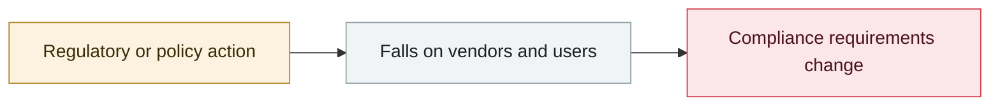

# "Slopsquatting" gets its name

     

## Summary

The term was coined by Python Software Foundation resident developer **Seth Larson**: it swaps the "human typo" of typosquatting for the "AI hallucination" — the model confidently recommends a package name that never existed, and an attacker registers it first. The scale was quantified by the USENIX Security 2025 paper "We Have a Package for You!": 16 code models produced 2.23 million samples, **19.7% of the recommended packages do not exist at all** (205,000 distinct hallucinated package names), with a mean hallucination rate of **21.7%** for open models and **5.2%** for commercial ones; **58% of hallucinated packages recur across 10 runs** — that is, predictable and squat-able

## Attack chain

## Sources

| # | Source | Link |
|---|---|---|
| 1 | Wikipedia | <https://en.wikipedia.org/wiki/Slopsquatting> |
| 2 | Socket | <https://socket.dev/blog/slopsquatting-how-ai-hallucinations-are-fueling-a-new-class-of-supply-chain-attacks> |

## Metadata

| Field | Value |
|---|---|
| Date | `2025-04-01` (raw: 2025-04, precision `month`) |
| Kind | Policy & regulation `policy` |
| Type | [`SUPPLY`](../../taxonomy/types.md#supply) Supply-chain poisoning |
| Severity | **Info** `info` |
| Confidence | **A** — primary source (vendor / victim / law enforcement / official report) |
| Real harm | n/a |
| AI involvement | Confirmed `confirmed` |
| Region | [Global](../../regions/global.md) |
| Archive ID | `2025-04-01-slopsquatting-gai-nian-cheng-xing` |

**Why this classification:** Policy / regulatory action, not counted in incident statistics; `severity` is recorded as `info`. Grading criteria: see [taxonomy/severity.md](../../taxonomy/severity.md) and [taxonomy/confidence.md](../../taxonomy/confidence.md).

## Related

**Topic:** [Agent supply-chain poisoning](../../topics/agent-supply-chain.md)

**Related records:**

- `2025-03-18` [Cursor / Copilot "Rules File Backdoor"](../2025-03/2025-03-18-cursor-copilot-rules-file.md)   Cursor / Copilot "Rules File Backdoor"
- `2025-02-06` [Hugging Face "nullifAI" malicious models](../2025-02/2025-02-06-hugging-face-nullifai.md)   Hugging Face "nullifAI" malicious models
- `2025-07-13` [Amazon Q Developer extension poisoned](../2025-07/2025-07-13-amazon-q-extension-poisoned.md)   Amazon Q Developer extension poisoned
- `2025-08-08` [Salesloft Drift OAuth token theft](../2025-08/2025-08-08-salesloft-drift-oauth-theft.md)   Salesloft Drift OAuth token theft

---

[← 2025-04 index](README.md) · [← All records](../../README.md) · [Chinese](../i18n/zh/2025-04/2025-04-01-slopsquatting-gai-nian-cheng-xing.md)

This record is part of the **Orca AI Incident Archive**, licensed [CC BY 4.0](../../LICENSE). Found a factual error or a missing source? [Open an issue or PR](../../CONTRIBUTING.md) — corrections are recorded in the record's revision history, never silently overwritten.
