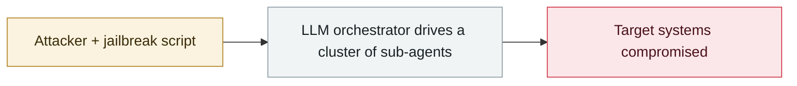

# Anthropic's first misuse report

     

## Summary

"Detecting and Countering Malicious Uses of Claude: March 2025": exposes "influence-as-a-service" — a professional service orchestrating **100+ social-media bot personas** with Claude, with the model deciding when to engage with political content

## Attack chain

## Sources

| # | Source | Link |
|---|---|---|
| 1 | Anthropic threat intelligence page | <https://www.anthropic.com/threat-intelligence> |

## Metadata

| Field | Value |
|---|---|
| Date | `2025-04-24` (raw: 2025-04-24, precision `day`) |
| Kind | Threat report `report` |
| Type | [`WEAPON`](../../taxonomy/types.md#weapon) Agent used as a weapon |
| Severity | **Info** `info` |
| Confidence | **A** — primary source (vendor / victim / law enforcement / official report) |
| Real harm | n/a |
| AI involvement | Confirmed `confirmed` |
| Region | [Global](../../regions/global.md) |
| Archive ID | `2025-04-24-anthropic-shou-fen-lan-yong` |

**Why this classification:** Threat intelligence report covering several incidents; it is not counted as a single incident itself, so `severity` is recorded as `info`. Grading criteria: see [taxonomy/severity.md](../../taxonomy/severity.md) and [taxonomy/confidence.md](../../taxonomy/confidence.md).

## Related

**Topic:** [Offensive AI capability evolution](../../topics/offensive-ai.md)

**Related records:**

- `2025-05-01` [Anthropic logs the start of GTG-2002 activity](../2025-05/2025-05-01-anthropic-gtg-ji-lu-huo.md)   Anthropic logs the start of GTG-2002 activity
- `2025-05-01` [AI-driven credential stuffing and scanning goes to scale](../2025-05/2025-05-01-qu-dong-zhuang-ku-zi.md)   AI-driven credential stuffing and scanning goes to scale
- `2025-06-01` [Check Point's "Skynet" sample](../2025-06/2025-06-01-check-point-skynet.md)   Check Point's "Skynet" sample
- `2025-06-01` [Anthropic logs the precursor to GTG-1002](../2025-06/2025-06-01-anthropic-gtg-ji-lu-shen.md)   Anthropic logs the precursor to GTG-1002

---

[← 2025-04 index](README.md) · [← All records](../../README.md) · [Chinese](../i18n/zh/2025-04/2025-04-24-anthropic-shou-fen-lan-yong.md)

This record is part of the **Orca AI Incident Archive**, licensed [CC BY 4.0](../../LICENSE). Found a factual error or a missing source? [Open an issue or PR](../../CONTRIBUTING.md) — corrections are recorded in the record's revision history, never silently overwritten.
