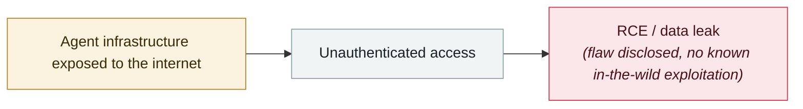

# NVIDIA TensorRT-LLM deserialization RCE

     

## Summary

CVE-2025-23254, CVSS 8.8, pickle IPC in the Python executor

## Attack chain

## Sources

| # | Source | Link |
|---|---|---|
| 1 | OWASP Q2'25 | <https://genai.owasp.org/2025/07/14/owasp-gen-ai-incident-exploit-round-up-q225/> |

## Metadata

| Field | Value |
|---|---|
| Date | `2025-04-29` (raw: 2025-04-29, precision `day`) |
| Kind | Vulnerability disclosure `vulnerability` |
| Type | [`INFRA`](../../taxonomy/types.md#infra) Agent infrastructure exposure |
| Severity | **Medium** `medium` |
| Confidence | **A** — primary source (vendor / victim / law enforcement / official report) |
| Real harm | No |
| AI involvement | Confirmed `confirmed` |
| Region | [Global](../../regions/global.md) |
| Archive ID | `2025-04-29-nvidia-tensorrt-llm-rce` |

**Why this classification:** Vulnerability disclosure; as of archiving there is no evidence of in-the-wild exploitation, so `real_harm: false`. Rated `medium`: controlled demo, moderate flaw, or an incident limited to a single user / single machine. Grading criteria: see [taxonomy/severity.md](../../taxonomy/severity.md) and [taxonomy/confidence.md](../../taxonomy/confidence.md).

## Related

**Topic:** [Agent infrastructure exposure](../../topics/agent-infra.md)

**Related records:**

- `2025-03-01` [ChatGPT SSRF CVE-2024-27564 exploited in the wild](../2025-03/2025-03-01-chatgpt-ssrf-ye-li-yong.md)   ChatGPT SSRF CVE-2024-27564 exploited in the wild
- `2025-03-03` [DeepSeek exposure window closes](../2025-03/2025-03-03-deepseek-bao-lu-chuang-kou.md)   DeepSeek exposure window closes
- `2025-02-01` [Thousands of Ollama servers exposed without auth](../2025-02/2025-02-01-ollama-fu-wu-qi-gui.md)   Thousands of Ollama servers exposed without auth
- `2025-01-29` [DeepSeek ClickHouse database left wide open](../2025-01/2025-01-29-deepseek-clickhouse-exposed.md)   DeepSeek ClickHouse database left wide open

---

[← 2025-04 index](README.md) · [← All records](../../README.md) · [Chinese](../i18n/zh/2025-04/2025-04-29-nvidia-tensorrt-llm-rce.md)

This record is part of the **Orca AI Incident Archive**, licensed [CC BY 4.0](../../LICENSE). Found a factual error or a missing source? [Open an issue or PR](../../CONTRIBUTING.md) — corrections are recorded in the record's revision history, never silently overwritten.
