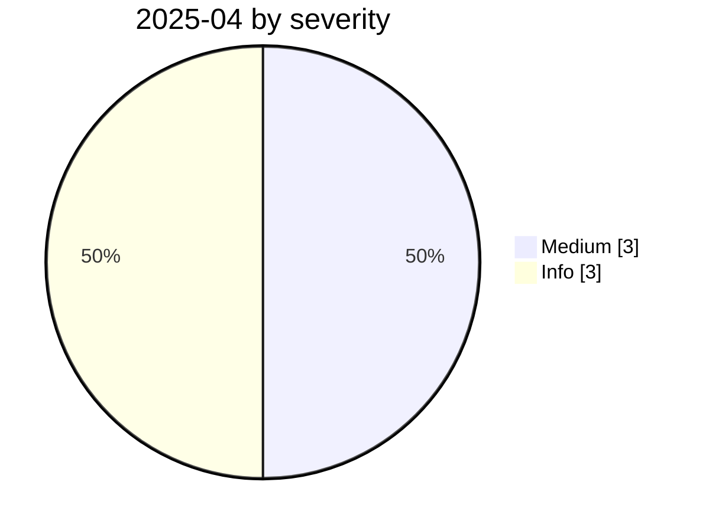

# 2025-04

<!-- BEGIN:summary -->
**6** records

  

## Records this month

| Date | Record | Type | Severity | Confidence | Real harm |
|---|---|---|---|---|---|
| `04-01` | [GPT-4.1 jailbroken through a poisoned MCP tool](2025-04-01-gpt-mcp-jing-gong-ju.md) | `MCP` | Medium | A | — |
| `04-01` | [First systematic disclosure of MCP tool-poisoning attacks](2025-04-01-mcp-tpa-gong-ju-tou.md) | `MCP` | Medium | A | — |
| `04-01` | [DeepSeek pulled from app stores in South Korea](2025-04-01-deepseek-han-guo-jia.md) | `GOV` | Info | A | · |
| `04-01` | ["Slopsquatting" gets its name](2025-04-01-slopsquatting-gai-nian-cheng-xing.md) | `SUPPLY` | Info | A | · |
| `04-24` | [Anthropic's first misuse report](2025-04-24-anthropic-shou-fen-lan-yong.md) | `WEAPON` | Info | A | · |
| `04-29` | [NVIDIA TensorRT-LLM deserialization RCE](2025-04-29-nvidia-tensorrt-llm-rce.md) | `INFRA` | Medium | A | — |

★ = `critical` · ⚠️ = disputed facts or attribution · real harm: ✅ confirmed victim / — none / · not applicable (policy and intelligence reports)
<!-- END:summary -->

<!-- BEGIN:nav -->
---

[← 2025-03](../2025-03/README.md) · [Archive index](../../README.md) · [By type](../../taxonomy/types.md) · [2025-05 →](../2025-05/README.md)
<!-- END:nav -->
