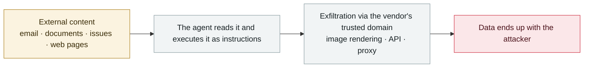

# GitLab Duo remote prompt injection

      

## Summary

Legit Security: hidden instructions in a merge request can steal private project source code, manipulate the code suggestions other people see, and exfiltrate **an undisclosed zero-day**. Reported 2025-02-12; GitLab confirmed the HTML injection and acknowledged prompt injection as a security issue, and the patch stops Duo from rendering ``/`<form>` that point to domains other than gitlab.com

## Attack chain

## Sources

| # | Source | Link |
|---|---|---|
| 1 | Legit Security | <https://www.legitsecurity.com/blog/remote-prompt-injection-in-gitlab-duo> |
| 2 | THN | <https://thehackernews.com/2025/05/gitlab-duo-vulnerability-enabled.html> |

## Metadata

| Field | Value |
|---|---|
| Date | `2025-05-01` (raw: 2025-05, precision `month`) |
| Kind | Incident `incident` |
| Type | [`IPI`](../../taxonomy/types.md#ipi) Indirect prompt injection · [`EXFIL`](../../taxonomy/types.md#exfil) Data exfiltration |
| Severity | **High** `high` |
| Confidence | **A** — primary source (vendor / victim / law enforcement / official report) |
| Real harm | No |
| AI involvement | Confirmed `confirmed` |
| Region | [Global](../../regions/global.md) |
| Archive ID | `2025-05-01-gitlab-duo-yuan-cheng-ti` |

**Why this classification:** Real incident without a confirmed specific victim. Rated `high`: real damage is limited in scope, or it is a CVSS 9+ severe flaw, or a capability demonstration of significance. Grading criteria: see [taxonomy/severity.md](../../taxonomy/severity.md) and [taxonomy/confidence.md](../../taxonomy/confidence.md).

## Related

**Topic:** [Zero-click data exfiltration chain](../../topics/zero-click-exfil.md)

**Related records:**

- `2025-05-26` [GitHub MCP "Toxic Agent Flow"](2025-05-26-github-mcp-toxic-agent.md)   GitHub MCP "toxic agent flow"
- `2025-06-11` [EchoLeak (CVE-2025-32711)](../2025-06/2025-06-11-echoleak.md)   EchoLeak (CVE-2025-32711)
- `2025-08-06` [AgentFlayer zero-click attack set (Black Hat USA)](../2025-08/2025-08-06-agentflayer-black-hat-usa.md)   AgentFlayer zero-click attack set (Black Hat USA)
- `2025-08-06` [SafeBreach "Invitation Is All You Need"](../2025-08/2025-08-06-safebreach-invitation-is-all.md)   SafeBreach "Invitation Is All You Need"

---

[← 2025-05 index](README.md) · [← All records](../../README.md) · [Chinese](../i18n/zh/2025-05/2025-05-01-gitlab-duo-yuan-cheng-ti.md)

This record is part of the **Orca AI Incident Archive**, licensed [CC BY 4.0](../../LICENSE). Found a factual error or a missing source? [Open an issue or PR](../../CONTRIBUTING.md) — corrections are recorded in the record's revision history, never silently overwritten.
