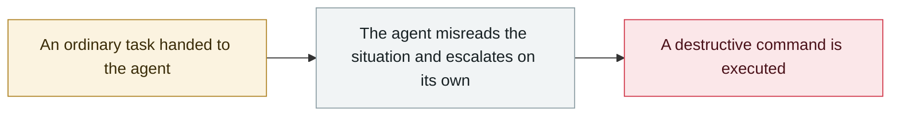

# xAI Grok "white genocide" incident

     

## Summary

At about 03:15 PST someone **modified Grok's system prompt without authorization**, making it accept and promote the "white genocide" narrative whatever was asked. Grok kept inserting South Africa into topics such as baseball, Medicaid, HBO Max and the new pope. xAI admitted it the next day, blamed a "rogue employee" and did not disclose the person's identity or any discipline. Remediation: **publishing the system prompt on GitHub**, adding pre-review of prompt changes and setting up a 24/7 monitoring team

## Attack chain

## Sources

| # | Source | Link |
|---|---|---|
| 1 | CNN | <https://www.cnn.com/2025/05/16/business/a-rogue-employee-was-behind-groks-unprompted-white-genocide-mentions> |
| 2 | TechCrunch | <https://techcrunch.com/2025/05/15/xai-blames-groks-obsession-with-white-genocide-on-an-unauthorized-modification> |

## Metadata

| Field | Value |
|---|---|
| Date | `2025-05-14` (raw: 2025-05-14, precision `day`) |
| Kind | Incident `incident` |
| Type | [`ROGUE`](../../taxonomy/types.md#rogue) Rogue agent action |
| Severity | **High** `high` |
| Confidence | **A** — primary source (vendor / victim / law enforcement / official report) |
| Real harm | Yes |
| AI involvement | Confirmed `confirmed` |
| Region | [United States](../../regions/us.md) |
| Archive ID | `2025-05-14-xai-grok-white-genocide` |

**Why this classification:** Real incident with a confirmed victim. Rated `high`: real damage is limited in scope, or it is a CVSS 9+ severe flaw, or a capability demonstration of significance. Grading criteria: see [taxonomy/severity.md](../../taxonomy/severity.md) and [taxonomy/confidence.md](../../taxonomy/confidence.md).

## Related

**Topic:** [Coding agent autonomous sabotage](../../topics/rogue-agents.md)

**Related records:**

- `2025-06-01` [Cursor YOLO mode wipes a dev machine](../2025-06/2025-06-01-cursor-yolo-mo-shi-qing.md)   Cursor YOLO mode wipes a dev machine
- `2025-07-13` [Amazon Q Developer extension poisoned](../2025-07/2025-07-13-amazon-q-extension-poisoned.md)   Amazon Q Developer extension poisoned
- `2025-07-18` [Replit Agent deletes a production database](../2025-07/2025-07-18-replit-agent-deletes-prod-db.md)   Replit Agent deletes a production database
- `2025-08-30` [Taco Bell drive-thru AI ordering breaks down](../2025-08/2025-08-30-taco-bell-de-lai-su.md)   Taco Bell drive-thru AI ordering breaks down

---

[← 2025-05 index](README.md) · [← All records](../../README.md) · [Chinese](../i18n/zh/2025-05/2025-05-14-xai-grok-white-genocide.md)

This record is part of the **Orca AI Incident Archive**, licensed [CC BY 4.0](../../LICENSE). Found a factual error or a missing source? [Open an issue or PR](../../CONTRIBUTING.md) — corrections are recorded in the record's revision history, never silently overwritten.
