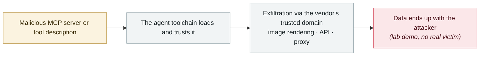

# GitHub MCP "toxic agent flow"

      

## Summary

Invariant Labs: instructions planted in a public issue made the agent write **private repository source code** into a public PR

## Attack chain

## Sources

| # | Source | Link |
|---|---|---|
| 1 | Reproduction code | <https://github.com/invariantlabs-ai/mcp-injection-experiments> |

## Metadata

| Field | Value |
|---|---|
| Date | `2025-05-26` (raw: 2025-05-26, precision `day`) |
| Kind | Research demo `research` |
| Type | [`MCP`](../../taxonomy/types.md#mcp) MCP & tool-chain · [`EXFIL`](../../taxonomy/types.md#exfil) Data exfiltration |
| Severity | **Medium** `medium` |
| Confidence | **A** — primary source (vendor / victim / law enforcement / official report) |
| Real harm | No |
| AI involvement | Confirmed `confirmed` |
| Region | [Global](../../regions/global.md) |
| Archive ID | `2025-05-26-github-mcp-toxic-agent` |

**Why this classification:** Controlled demo by a research lab or vendor, `real_harm: false`; the record marks when the attack surface became public. Rated `medium`: controlled demo, moderate flaw, or an incident limited to a single user / single machine. Grading criteria: see [taxonomy/severity.md](../../taxonomy/severity.md) and [taxonomy/confidence.md](../../taxonomy/confidence.md).

## Related

**Topic:** [Agent supply-chain poisoning](../../topics/agent-supply-chain.md) · [Zero-click data exfiltration chain](../../topics/zero-click-exfil.md)

**Related records:**

- `2025-05-01` [GitLab Duo remote prompt injection](2025-05-01-gitlab-duo-yuan-cheng-ti.md)   GitLab Duo remote prompt injection
- `2025-06-11` [EchoLeak (CVE-2025-32711)](../2025-06/2025-06-11-echoleak.md)   EchoLeak (CVE-2025-32711)
- `2025-06-13` [MCP Inspector unauthenticated RCE](../2025-06/2025-06-13-mcp-inspector-rce.md)   MCP Inspector unauthenticated RCE
- `2025-04-01` [First systematic disclosure of MCP tool-poisoning attacks](../2025-04/2025-04-01-mcp-tpa-gong-ju-tou.md)   First systematic disclosure of MCP tool-poisoning attacks

---

[← 2025-05 index](README.md) · [← All records](../../README.md) · [Chinese](../i18n/zh/2025-05/2025-05-26-github-mcp-toxic-agent.md)

This record is part of the **Orca AI Incident Archive**, licensed [CC BY 4.0](../../LICENSE). Found a factual error or a missing source? [Open an issue or PR](../../CONTRIBUTING.md) — corrections are recorded in the record's revision history, never silently overwritten.
