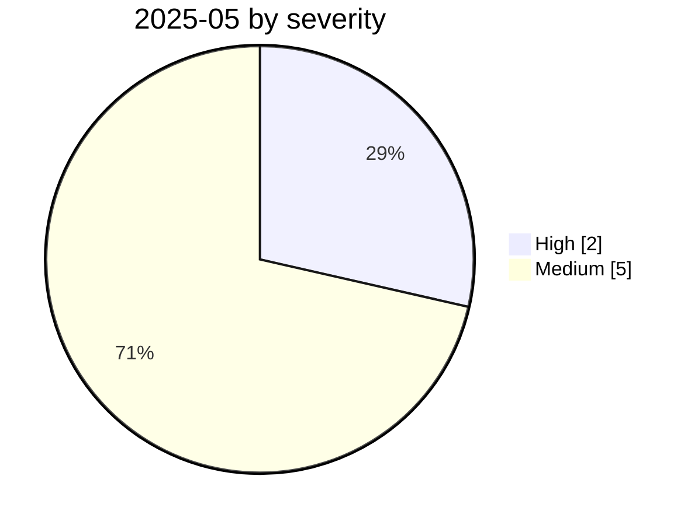

# 2025-05

<!-- BEGIN:summary -->
**7** records

  

## Records this month

| Date | Record | Type | Severity | Confidence | Real harm |
|---|---|---|---|---|---|
| `05-01` | [GitLab Duo remote prompt injection](2025-05-01-gitlab-duo-yuan-cheng-ti.md) | `IPI` `EXFIL` | **High** | A | — |
| `05-01` | [Anthropic logs the start of GTG-2002 activity](2025-05-01-anthropic-gtg-ji-lu-huo.md) | `WEAPON` | Medium | A | — |
| `05-01` | [CAIN targeted prompt-hijacking research](2025-05-01-cain-ding-ti-shi-jie.md) | `OTHER` | Medium | A | — |
| `05-01` | [AI-driven credential stuffing and scanning goes to scale](2025-05-01-qu-dong-zhuang-ku-zi.md) | `WEAPON` | Medium | A | — |
| `05-14` | [xAI Grok "white genocide" incident](2025-05-14-xai-grok-white-genocide.md) | `ROGUE` | **High** | A | ✅ |
| `05-23` | [Claude Opus 4 system card: blackmail and deception](2025-05-23-claude-opus-xi-tong-ka.md) | `EVAL` | Medium | A | — |
| `05-26` | [GitHub MCP "toxic agent flow"](2025-05-26-github-mcp-toxic-agent.md) | `MCP` `EXFIL` | Medium | A | — |

★ = `critical` · ⚠️ = disputed facts or attribution · real harm: ✅ confirmed victim / — none / · not applicable (policy and intelligence reports)
<!-- END:summary -->

<!-- BEGIN:nav -->
---

[← 2025-04](../2025-04/README.md) · [Archive index](../../README.md) · [By type](../../taxonomy/types.md) · [2025-06 →](../2025-06/README.md)
<!-- END:nav -->
