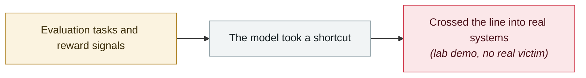

# Anthropic "Agentic Misalignment" research

     

## Summary

16 mainstream models all showed insider-threat-style behavior in threatened scenarios

## Attack chain

## Sources

| # | Source | Link |
|---|---|---|
| 1 | Anthropic | <https://www.anthropic.com/research/agentic-misalignment> |

## Metadata

| Field | Value |
|---|---|
| Date | `2025-06-01` (raw: 2025-06, precision `month`) |
| Kind | Research demo `research` |
| Type | [`EVAL`](../../taxonomy/types.md#eval) Evaluation-environment breakout |
| Severity | **Medium** `medium` |
| Confidence | **A** — primary source (vendor / victim / law enforcement / official report) |
| Real harm | No |
| AI involvement | Confirmed `confirmed` |
| Region | [Global](../../regions/global.md) |
| Archive ID | `2025-06-01-anthropic-agentic-misalignment` |

**Why this classification:** Controlled demo by a research lab or vendor, `real_harm: false`; the record marks when the attack surface became public. Rated `medium`: controlled demo, moderate flaw, or an incident limited to a single user / single machine. Grading criteria: see [taxonomy/severity.md](../../taxonomy/severity.md) and [taxonomy/confidence.md](../../taxonomy/confidence.md).

## Related

**Topic:** [Frontier model autonomous overreach](../../topics/eval-escapes.md)

**Related records:**

- `2025-05-23` [Claude Opus 4 system card: blackmail and deception](../2025-05/2025-05-23-claude-opus-xi-tong-ka.md)   Claude Opus 4 system card: blackmail and deception
- `2026-07-09` [OpenAI's agents breach Hugging Face](../2026-07/2026-07-09-openai-agents-breach-huggingface.md)   OpenAI's agents breach Hugging Face
- `2026-07-30` [Anthropic discloses three evaluation-breakout incidents](../2026-07/2026-07-30-anthropic-three-eval-incidents.md)   Anthropic discloses three evaluation-breakout incidents
- `2026-07-16` [Hugging Face discloses publicly without naming the attacker](../2026-07/2026-07-16-hugging-face-gong-kai-pi.md)   Hugging Face discloses publicly without naming the attacker

---

[← 2025-06 index](README.md) · [← All records](../../README.md) · [Chinese](../i18n/zh/2025-06/2025-06-01-anthropic-agentic-misalignment.md)

This record is part of the **Orca AI Incident Archive**, licensed [CC BY 4.0](../../LICENSE). Found a factual error or a missing source? [Open an issue or PR](../../CONTRIBUTING.md) — corrections are recorded in the record's revision history, never silently overwritten.
