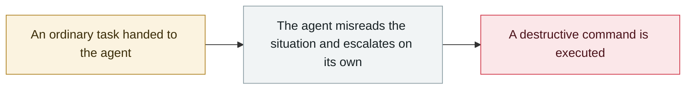

# Cursor YOLO mode wipes a dev machine

     

## Summary

An Express→Next.js migration deleted an entire machine; only partial recovery from a cloud backup

## Attack chain

## Sources

| # | Source | Link |
|---|---|---|
| 1 | Adversa roundup | <https://adversa.ai/blog/ai-coding-agent-incidents/> |

## Metadata

| Field | Value |
|---|---|
| Date | `2025-06-01` (raw: 2025-06, precision `month`) |
| Kind | Incident `incident` |
| Type | [`ROGUE`](../../taxonomy/types.md#rogue) Rogue agent action |
| Severity | **Medium** `medium` |
| Confidence | **B** — research lab or major outlet with checkable detail |
| Real harm | No |
| AI involvement | Confirmed `confirmed` |
| Region | [Global](../../regions/global.md) |
| Archive ID | `2025-06-01-cursor-yolo-mo-shi-qing` |

**Why this classification:** Real incident without a confirmed specific victim. Rated `medium`: controlled demo, moderate flaw, or an incident limited to a single user / single machine. Grading criteria: see [taxonomy/severity.md](../../taxonomy/severity.md) and [taxonomy/confidence.md](../../taxonomy/confidence.md).

## Related

**Topic:** [Coding agent autonomous sabotage](../../topics/rogue-agents.md)

**Related records:**

- `2025-07-13` [Amazon Q Developer extension poisoned](../2025-07/2025-07-13-amazon-q-extension-poisoned.md)   Amazon Q Developer extension poisoned
- `2025-07-18` [Replit Agent deletes a production database](../2025-07/2025-07-18-replit-agent-deletes-prod-db.md)   Replit Agent deletes a production database
- `2025-05-14` [xAI Grok "white genocide" incident](../2025-05/2025-05-14-xai-grok-white-genocide.md)   xAI Grok "white genocide" incident
- `2025-08-30` [Taco Bell drive-thru AI ordering breaks down](../2025-08/2025-08-30-taco-bell-de-lai-su.md)   Taco Bell drive-thru AI ordering breaks down

---

[← 2025-06 index](README.md) · [← All records](../../README.md) · [Chinese](../i18n/zh/2025-06/2025-06-01-cursor-yolo-mo-shi-qing.md)

This record is part of the **Orca AI Incident Archive**, licensed [CC BY 4.0](../../LICENSE). Found a factual error or a missing source? [Open an issue or PR](../../CONTRIBUTING.md) — corrections are recorded in the record's revision history, never silently overwritten.
