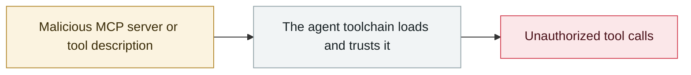

# Asana MCP server cross-tenant data exposure

     

> [!WARNING]
> **This record contains disputed or not fully confirmed facts**; the claims of each party are kept side by side in the body, so do not cite any single one of them in isolation.

## Summary

The feature went live on 2025-05-01; an access-control flaw was **found on 06-04**, exposing around **1,000 customers'** tasks, project metadata, comments and files to other tenants (subject to their respective permissions); **access restored on 06-17**

## Attack chain

## Sources

| # | Source | Link |
|---|---|---|
| 1 | Practical DevSecOps roundup | <https://www.practical-devsecops.com/mcp-security-statistics-2026-report/> |

## Metadata

| Field | Value |
|---|---|
| Date | `2025-06-04` (raw: 2025-06-04, precision `day`) |
| Kind | Vulnerability disclosure `vulnerability` |
| Type | [`MCP`](../../taxonomy/types.md#mcp) MCP & tool-chain |
| Severity | **Medium** `medium` |
| Confidence | **B** — research lab or major outlet with checkable detail |
| Real harm | Yes |
| AI involvement | Confirmed `confirmed` |
| Region | [Global](../../regions/global.md) |
| Archive ID | `2025-06-04-asana-mcp-server` |

**Why this classification:** Vulnerability disclosure with confirmed in-the-wild exploitation, so `real_harm: true`. Rated `medium`: controlled demo, moderate flaw, or an incident limited to a single user / single machine. Grading criteria: see [taxonomy/severity.md](../../taxonomy/severity.md) and [taxonomy/confidence.md](../../taxonomy/confidence.md).

## Related

**Topic:** [Agent supply-chain poisoning](../../topics/agent-supply-chain.md)

**Related records:**

- `2025-06-13` [MCP Inspector unauthenticated RCE](2025-06-13-mcp-inspector-rce.md)   MCP Inspector unauthenticated RCE
- `2025-06-13` [Smithery.ai path traversal](2025-06-13-smithery-ai-lu-jing-chuan-yue.md)   Smithery.ai path traversal
- `2025-07-06` [Supabase MCP prompt injection dumps a private table](../2025-07/2025-07-06-supabase-mcp-ti-shi-zhu.md)   Supabase MCP prompt injection dumps a private table
- `2025-05-26` [GitHub MCP "toxic agent flow"](../2025-05/2025-05-26-github-mcp-toxic-agent.md)   GitHub MCP "toxic agent flow"

---

[← 2025-06 index](README.md) · [← All records](../../README.md) · [Chinese](../i18n/zh/2025-06/2025-06-04-asana-mcp-server.md)

This record is part of the **Orca AI Incident Archive**, licensed [CC BY 4.0](../../LICENSE). Found a factual error or a missing source? [Open an issue or PR](../../CONTRIBUTING.md) — corrections are recorded in the record's revision history, never silently overwritten.
