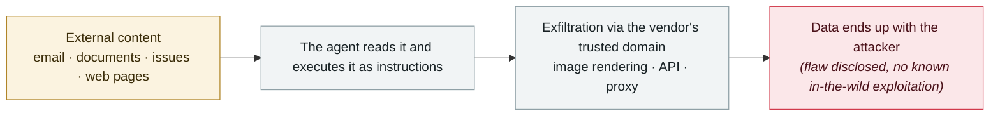

# EchoLeak (CVE-2025-32711)

      

## Summary

Disclosed by Aim Security. **The first zero-click AI agent vulnerability**, CVSS 9.3. A single email could make M365 Copilot carry OneDrive/SharePoint/Teams data out; it used reference-style Markdown image links to bypass link sanitization. Introduced the attack paradigm **"LLM Scope Violation"** (untrusted input treated as trusted instructions). **The first "no user action required" AI CVE from Microsoft**, fixed server-side, with no known in-the-wild exploitation

## Attack chain

## Details

Before EchoLeak, the mainstream narrative around prompt injection was still about users being tricked into clicking something. EchoLeak proved that as long as an agent has permission to read your inbox, the attacker **only needs to send one email** — the victim never has to do anything at all.
The entire exploit chain (injection → retrieval → rendering → exfiltration) **takes place entirely inside the vendor's own infrastructure**.
It directly spawned an entire family of follow-ups: CamoLeak, ShadowLeak, ForcedLeak, Reprompt, SearchLeak, ShareLeak, PipeLeak, GitLost.

## Sources

| # | Source | Link |
|---|---|---|
| 1 | THN | <https://thehackernews.com/2025/06/zero-click-ai-vulnerability-exposes.html> |
| 2 | Businesswire(Aim) | <https://www.businesswire.com/news/home/20250611349150/en> |

## Metadata

| Field | Value |
|---|---|
| Date | `2025-06-11` (raw: 2025-06-11, precision `day`) |
| Kind | Vulnerability disclosure `vulnerability` |
| Type | [`IPI`](../../taxonomy/types.md#ipi) Indirect prompt injection · [`EXFIL`](../../taxonomy/types.md#exfil) Data exfiltration |
| Severity | **High** `high` |
| Confidence | **A** — primary source (vendor / victim / law enforcement / official report) |
| Real harm | No |
| AI involvement | Confirmed `confirmed` |
| Region | [Global](../../regions/global.md) |
| Archive ID | `2025-06-11-echoleak` |

**Why this classification:** Vulnerability disclosure; as of archiving there is no evidence of in-the-wild exploitation, so `real_harm: false`. Rated `high`: real damage is limited in scope, or it is a CVSS 9+ severe flaw, or a capability demonstration of significance. Grading criteria: see [taxonomy/severity.md](../../taxonomy/severity.md) and [taxonomy/confidence.md](../../taxonomy/confidence.md).

## Related

**Topic:** [Zero-click data exfiltration chain](../../topics/zero-click-exfil.md)

**Related records:**

- `2025-05-01` [GitLab Duo remote prompt injection](../2025-05/2025-05-01-gitlab-duo-yuan-cheng-ti.md)   GitLab Duo remote prompt injection
- `2025-05-26` [GitHub MCP "toxic agent flow"](../2025-05/2025-05-26-github-mcp-toxic-agent.md)   GitHub MCP "toxic agent flow"
- `2025-08-06` [AgentFlayer zero-click attack set (Black Hat USA)](../2025-08/2025-08-06-agentflayer-black-hat-usa.md)   AgentFlayer zero-click attack set (Black Hat USA)
- `2025-08-06` [SafeBreach "Invitation Is All You Need"](../2025-08/2025-08-06-safebreach-invitation-is-all.md)   SafeBreach "Invitation Is All You Need"

---

[← 2025-06 index](README.md) · [← All records](../../README.md) · [Chinese](../i18n/zh/2025-06/2025-06-11-echoleak.md)

This record is part of the **Orca AI Incident Archive**, licensed [CC BY 4.0](../../LICENSE). Found a factual error or a missing source? [Open an issue or PR](../../CONTRIBUTING.md) — corrections are recorded in the record's revision history, never silently overwritten.
