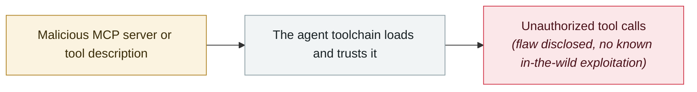

# MCP Inspector unauthenticated RCE

     

## Summary

Oligo Security found CVE-2025-49596, **CVSS 9.4**. Chained with the browser "0.0.0.0 Day" + CSRF — **simply visiting a malicious website could execute arbitrary code on a developer's machine**. Anthropic fixed it in v0.14.1 (2025-06-13): the proxy server now requires a session token and validates Host/Origin

## Attack chain

## Sources

| # | Source | Link |
|---|---|---|
| 1 | Oligo | <https://www.oligo.security/blog/critical-rce-vulnerability-in-anthropic-mcp-inspector-cve-2025-49596> |
| 2 | GHSA | <https://github.com/advisories/GHSA-7f8r-222p-6f5g> |

## Metadata

| Field | Value |
|---|---|
| Date | `2025-06-13` (raw: 2025-06-13, precision `day`) |
| Kind | Vulnerability disclosure `vulnerability` |
| Type | [`MCP`](../../taxonomy/types.md#mcp) MCP & tool-chain |
| Severity | **High** `high` |
| Confidence | **A** — primary source (vendor / victim / law enforcement / official report) |
| Real harm | No |
| AI involvement | Confirmed `confirmed` |
| Region | [Global](../../regions/global.md) |
| Archive ID | `2025-06-13-mcp-inspector-rce` |

**Why this classification:** Vulnerability disclosure; as of archiving there is no evidence of in-the-wild exploitation, so `real_harm: false`. Rated `high`: real damage is limited in scope, or it is a CVSS 9+ severe flaw, or a capability demonstration of significance. Grading criteria: see [taxonomy/severity.md](../../taxonomy/severity.md) and [taxonomy/confidence.md](../../taxonomy/confidence.md).

## Related

**Topic:** [Agent supply-chain poisoning](../../topics/agent-supply-chain.md)

**Related records:**

- `2025-06-04` [Asana MCP server cross-tenant data exposure](2025-06-04-asana-mcp-server.md)   Asana MCP server cross-tenant data exposure
- `2025-06-13` [Smithery.ai path traversal](2025-06-13-smithery-ai-lu-jing-chuan-yue.md)   Smithery.ai path traversal
- `2025-07-06` [Supabase MCP prompt injection dumps a private table](../2025-07/2025-07-06-supabase-mcp-ti-shi-zhu.md)   Supabase MCP prompt injection dumps a private table
- `2025-05-26` [GitHub MCP "toxic agent flow"](../2025-05/2025-05-26-github-mcp-toxic-agent.md)   GitHub MCP "toxic agent flow"

---

[← 2025-06 index](README.md) · [← All records](../../README.md) · [Chinese](../i18n/zh/2025-06/2025-06-13-mcp-inspector-rce.md)

This record is part of the **Orca AI Incident Archive**, licensed [CC BY 4.0](../../LICENSE). Found a factual error or a missing source? [Open an issue or PR](../../CONTRIBUTING.md) — corrections are recorded in the record's revision history, never silently overwritten.
