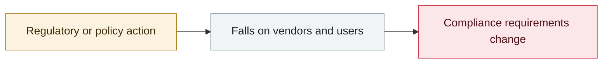

# Simon Willison names the "lethal trifecta"

     

## Summary

Private data + untrusted content + outbound capability — almost every later exfiltration chain fits this framework

## Attack chain

## Sources

| # | Source | Link |
|---|---|---|
| 1 | Simon Willison | <https://simonw.substack.com/p/the-lethal-trifecta-for-ai-agents> |

## Metadata

| Field | Value |
|---|---|
| Date | `2025-06-16` (raw: 2025-06-16, precision `day`) |
| Kind | Policy & regulation `policy` |
| Type | [`GOV`](../../taxonomy/types.md#gov) Governance & policy |
| Severity | **Info** `info` |
| Confidence | **A** — primary source (vendor / victim / law enforcement / official report) |
| Real harm | n/a |
| AI involvement | Confirmed `confirmed` |
| Region | [Global](../../regions/global.md) |
| Archive ID | `2025-06-16-simon-willison-ti-chu-zhi` |

**Why this classification:** Policy / regulatory action, not counted in incident statistics; `severity` is recorded as `info`. Grading criteria: see [taxonomy/severity.md](../../taxonomy/severity.md) and [taxonomy/confidence.md](../../taxonomy/confidence.md).

## Related

**Topic:** [Defense & governance](../../topics/defense.md)

**Related records:**

- `2025-04-01` [DeepSeek pulled from app stores in South Korea](../2025-04/2025-04-01-deepseek-han-guo-jia.md)   DeepSeek pulled from app stores in South Korea
- `2025-08-25` [Anthropic starts the Claude for Chrome pilot](../2025-08/2025-08-25-anthropic-claude-chrome.md)   Anthropic starts the Claude for Chrome pilot
- `2025-03-01` [Sony pulls 75,000+ AI deepfake tracks](../2025-03/2025-03-01-sony-jia-wan-shen-wei.md)   Sony pulls 75,000+ AI deepfake tracks
- `2025-02-21` [OpenAI bans accounts behind the "Peer Review" surveillance tool](../2025-02/2025-02-21-peer-review-feng-jin-jian.md)   OpenAI bans accounts behind the "Peer Review" surveillance tool

---

[← 2025-06 index](README.md) · [← All records](../../README.md) · [Chinese](../i18n/zh/2025-06/2025-06-16-simon-willison-ti-chu-zhi.md)

This record is part of the **Orca AI Incident Archive**, licensed [CC BY 4.0](../../LICENSE). Found a factual error or a missing source? [Open an issue or PR](../../CONTRIBUTING.md) — corrections are recorded in the record's revision history, never silently overwritten.
