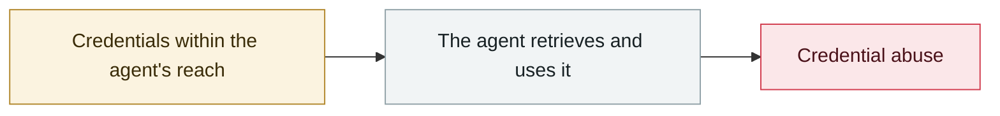

# McDonald's McHire "Olivia" hiring bot

     

## Summary

Researchers Ian Carroll + Sam Curry found that a Paradox.ai test admin account had the username/password `123456` and no MFA; combined with an IDOR (changing the applicant ID in the URL) it could read other people's names/emails/phone numbers/chat logs. **Up to 64 million records were theoretically reachable**. ⚠️ **Paradox claims only 5 were actually accessed**; fixed within a day

## Attack chain

## Sources

| # | Source | Link |
|---|---|---|
| 1 | AIID #1179 | <https://incidentdatabase.ai/cite/1179/> |
| 2 | CSO | <https://www.csoonline.com/article/4020919/mcdonalds-ai-hiring-tools-password-123456-exposes-data-of-64m-applicants.html> |

## Metadata

| Field | Value |
|---|---|
| Date | `2025-06-30` (raw: 2025-06-30, precision `day`) |
| Kind | Incident `incident` |
| Type | [`CRED`](../../taxonomy/types.md#cred) Credential abuse |
| Severity | **High** `high` |
| Confidence | **A** — primary source (vendor / victim / law enforcement / official report) |
| Real harm | Yes |
| AI involvement | Confirmed `confirmed` |
| Region | [United States](../../regions/us.md) |
| Archive ID | `2025-06-30-mcdonald-mchire-olivia` |

**Why this classification:** Real incident with a confirmed victim. Rated `high`: real damage is limited in scope, or it is a CVSS 9+ severe flaw, or a capability demonstration of significance. Grading criteria: see [taxonomy/severity.md](../../taxonomy/severity.md) and [taxonomy/confidence.md](../../taxonomy/confidence.md).

## Related

**Related records:**

- `2025-06-13` [Smithery.ai path traversal](2025-06-13-smithery-ai-lu-jing-chuan-yue.md)   Smithery.ai path traversal
- `2025-07-01` [RoguePilot](../2025-07/2025-07-01-roguepilot.md)   RoguePilot
- `2025-07-09` [McHire flaw goes public](../2025-07/2025-07-09-mchire-lou-dong-gong-kai.md)   McHire flaw goes public
- `2025-08-08` [Salesloft Drift OAuth token theft](../2025-08/2025-08-08-salesloft-drift-oauth-theft.md)   Salesloft Drift OAuth token theft

---

[← 2025-06 index](README.md) · [← All records](../../README.md) · [Chinese](../i18n/zh/2025-06/2025-06-30-mcdonald-mchire-olivia.md)

This record is part of the **Orca AI Incident Archive**, licensed [CC BY 4.0](../../LICENSE). Found a factual error or a missing source? [Open an issue or PR](../../CONTRIBUTING.md) — corrections are recorded in the record's revision history, never silently overwritten.
