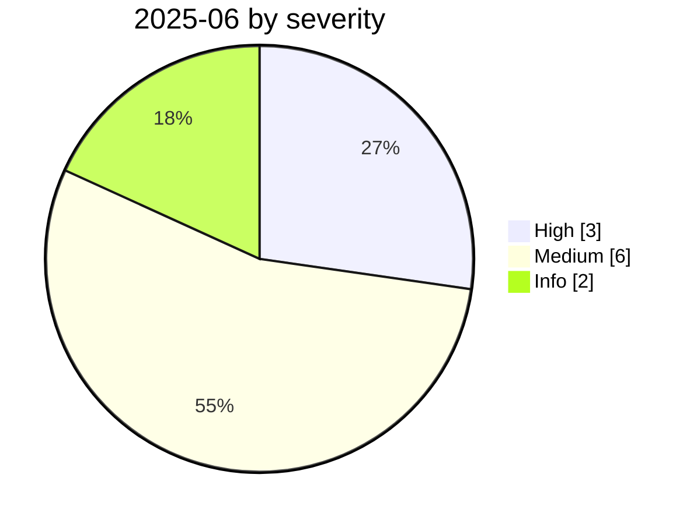

# 2025-06

<!-- BEGIN:summary -->
**11** records

   

## Records this month

| Date | Record | Type | Severity | Confidence | Real harm |
|---|---|---|---|---|---|
| `06-01` | [Anthropic "Agentic Misalignment" research](2025-06-01-anthropic-agentic-misalignment.md) | `EVAL` | Medium | A | — |
| `06-01` | [Anthropic logs the precursor to GTG-1002](2025-06-01-anthropic-gtg-ji-lu-shen.md) | `WEAPON` | Medium | A | — |
| `06-01` | [Check Point's "Skynet" sample](2025-06-01-check-point-skynet.md) | `WEAPON` | Medium | A | — |
| `06-01` | [Cursor YOLO mode wipes a dev machine](2025-06-01-cursor-yolo-mo-shi-qing.md) | `ROGUE` | Medium | B | — |
| `06-04` | [Asana MCP server cross-tenant data exposure](2025-06-04-asana-mcp-server.md) ⚠️ | `MCP` | Medium | B | ✅ |
| `06-05` | [OpenAI June threat report](2025-06-05-liu-wei-xie-bao-gao.md) | `WEAPON` | Info | A | · |
| `06-11` | [EchoLeak (CVE-2025-32711)](2025-06-11-echoleak.md) | `IPI` `EXFIL` | **High** | A | — |
| `06-13` | [MCP Inspector unauthenticated RCE](2025-06-13-mcp-inspector-rce.md) | `MCP` | **High** | A | — |
| `06-13` | [Smithery.ai path traversal](2025-06-13-smithery-ai-lu-jing-chuan-yue.md) | `MCP` `CRED` | Medium | B | — |
| `06-16` | [Simon Willison names the "lethal trifecta"](2025-06-16-simon-willison-ti-chu-zhi.md) | `GOV` | Info | A | · |
| `06-30` | [McDonald's McHire "Olivia" hiring bot](2025-06-30-mcdonald-mchire-olivia.md) | `CRED` | **High** | A | ✅ |

★ = `critical` · ⚠️ = disputed facts or attribution · real harm: ✅ confirmed victim / — none / · not applicable (policy and intelligence reports)
<!-- END:summary -->

<!-- BEGIN:nav -->
---

[← 2025-05](../2025-05/README.md) · [Archive index](../../README.md) · [By type](../../taxonomy/types.md) · [2025-07 →](../2025-07/README.md)
<!-- END:nav -->
