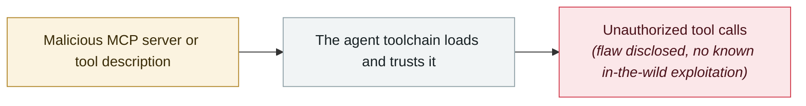

# mcp-remote OAuth command injection

     

## Summary

CVE-2025-6514: a malicious MCP server can execute arbitrary commands on the client

## Attack chain

## Sources

| # | Source | Link |
|---|---|---|
| 1 | Japan IPA 2025-12 | <https://www.ipa.go.jp/digital/ai/security/ai-security-bulletin.html> |

## Metadata

| Field | Value |
|---|---|
| Date | `2025-07-01` (raw: 2025-07, precision `month`) |
| Kind | Vulnerability disclosure `vulnerability` |
| Type | [`MCP`](../../taxonomy/types.md#mcp) MCP & tool-chain |
| Severity | **Medium** `medium` |
| Confidence | **A** — primary source (vendor / victim / law enforcement / official report) |
| Real harm | No |
| AI involvement | Confirmed `confirmed` |
| Region | [Global](../../regions/global.md) |
| Archive ID | `2025-07-01-mcp-remote-oauth` |

**Why this classification:** Vulnerability disclosure; as of archiving there is no evidence of in-the-wild exploitation, so `real_harm: false`. Rated `medium`: controlled demo, moderate flaw, or an incident limited to a single user / single machine. Grading criteria: see [taxonomy/severity.md](../../taxonomy/severity.md) and [taxonomy/confidence.md](../../taxonomy/confidence.md).

## Related

**Topic:** [Agent supply-chain poisoning](../../topics/agent-supply-chain.md)

**Related records:**

- `2025-07-06` [Supabase MCP prompt injection dumps a private table](2025-07-06-supabase-mcp-ti-shi-zhu.md)   Supabase MCP prompt injection dumps a private table
- `2025-07-01` [Anthropic Filesystem MCP sandbox escape](2025-07-01-anthropic-filesystem-mcp.md)   Anthropic Filesystem MCP sandbox escape
- `2025-06-13` [MCP Inspector unauthenticated RCE](../2025-06/2025-06-13-mcp-inspector-rce.md)   MCP Inspector unauthenticated RCE
- `2025-08-05` [Cursor MCPoison (CVE-2025-54136)](../2025-08/2025-08-05-cursor-mcpoison.md)   Cursor MCPoison (CVE-2025-54136)

---

[← 2025-07 index](README.md) · [← All records](../../README.md) · [Chinese](../i18n/zh/2025-07/2025-07-01-mcp-remote-oauth.md)

This record is part of the **Orca AI Incident Archive**, licensed [CC BY 4.0](../../LICENSE). Found a factual error or a missing source? [Open an issue or PR](../../CONTRIBUTING.md) — corrections are recorded in the record's revision history, never silently overwritten.
