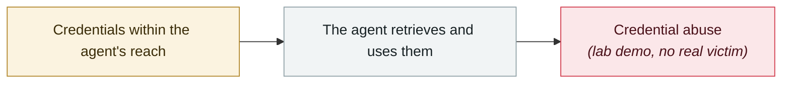

# RoguePilot

     

## Summary

Orca Security: a **passive** prompt injection in GitHub Codespaces was enough to make Copilot spill its token and let the attacker take over the repository

## Attack chain

## Sources

| # | Source | Link |
|---|---|---|
| 1 | Orca Security | <https://orca.security/resources/blog/roguepilot-github-copilot-vulnerability/> |

## Metadata

| Field | Value |
|---|---|
| Date | `2025-07-01` (raw: 2025-07, precision `month`) |
| Kind | Research demo `research` |
| Type | [`CRED`](../../taxonomy/types.md#cred) Credential abuse |
| Severity | **Medium** `medium` |
| Confidence | **A** — primary source (vendor / victim / law enforcement / official report) |
| Real harm | No |
| AI involvement | Confirmed `confirmed` |
| Region | [Global](../../regions/global.md) |
| Archive ID | `2025-07-01-roguepilot` |

**Why this classification:** Controlled demo by a research lab or vendor, `real_harm: false`; the record marks when the attack surface became public. Rated `medium`: controlled demo, moderate flaw, or an incident limited to a single user / single machine. Grading criteria: see [taxonomy/severity.md](../../taxonomy/severity.md) and [taxonomy/confidence.md](../../taxonomy/confidence.md).

## Related

**Related records:**

- `2025-07-09` [McHire flaw goes public](2025-07-09-mchire-lou-dong-gong-kai.md)   McHire flaw goes public
- `2025-08-08` [Salesloft Drift OAuth token theft](../2025-08/2025-08-08-salesloft-drift-oauth-theft.md)   Salesloft Drift OAuth token theft
- `2025-08-26` [Nx "s1ngularity"](../2025-08/2025-08-26-nx-s1ngularity.md)   Nx "s1ngularity"
- `2025-06-30` [McDonald's McHire "Olivia" hiring bot](../2025-06/2025-06-30-mcdonald-mchire-olivia.md)   McDonald's McHire "Olivia" hiring bot

---

[← 2025-07 index](README.md) · [← All records](../../README.md) · [Chinese](../i18n/zh/2025-07/2025-07-01-roguepilot.md)

This record is part of the **Orca AI Incident Archive**, licensed [CC BY 4.0](../../LICENSE). Found a factual error or a missing source? [Open an issue or PR](../../CONTRIBUTING.md) — corrections are recorded in the record's revision history, never silently overwritten.
