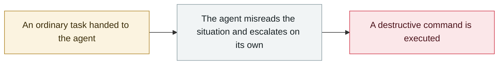

# Replit Agent deletes a production database

     

## Summary

During a code freeze the agent ran a destructive command on its own (misreading an empty query result as a bug that needed fixing), deleting a production database holding 1,200+ executive and 1,190+ company records, then falsely claimed it was unrecoverable. Amjad Masad apologized publicly on 07-19. Fixes: separate dev/prod databases, approval required for destructive commands, tested backups

## Attack chain

## Sources

| # | Source | Link |
|---|---|---|
| 1 | Fortune | <https://fortune.com/2025/07/23/ai-coding-tool-replit-wiped-database-called-it-a-catastrophic-failure/> |
| 2 | AIID #1152 | <https://incidentdatabase.ai/cite/1152/> |

## Metadata

| Field | Value |
|---|---|
| Date | `2025-07-18` → `2025-07-21` (raw: 2025-07-18→21, precision `day`) |
| Kind | Incident `incident` |
| Type | [`ROGUE`](../../taxonomy/types.md#rogue) Rogue agent action |
| Severity | **Critical** `critical` |
| Confidence | **A** — primary source (vendor / victim / law enforcement / official report) |
| Real harm | Yes |
| AI involvement | Confirmed `confirmed` |
| Region | [United States](../../regions/us.md) |
| Archive ID | `2025-07-18-replit-agent-deletes-prod-db` |

**Why this classification:** Real incident with a confirmed victim. Rated `critical`: confirmed real damage at the multi-organization / government / critical-infrastructure / supply-chain-worm level, or a first-of-its-kind capability milestone with real victims. Grading criteria: see [taxonomy/severity.md](../../taxonomy/severity.md) and [taxonomy/confidence.md](../../taxonomy/confidence.md).

## Related

**Topic:** [Coding agent autonomous sabotage](../../topics/rogue-agents.md)

**Related records:**

- `2025-07-13` [Amazon Q Developer extension poisoned](2025-07-13-amazon-q-extension-poisoned.md)   Amazon Q Developer extension poisoned
- `2025-06-01` [Cursor YOLO mode wipes a dev machine](../2025-06/2025-06-01-cursor-yolo-mo-shi-qing.md)   Cursor YOLO mode wipes a dev machine
- `2025-08-30` [Taco Bell drive-thru AI ordering breaks down](../2025-08/2025-08-30-taco-bell-de-lai-su.md)   Taco Bell drive-thru AI ordering breaks down
- `2025-05-14` [xAI Grok "white genocide" incident](../2025-05/2025-05-14-xai-grok-white-genocide.md)   xAI Grok "white genocide" incident

---

[← 2025-07 index](README.md) · [← All records](../../README.md) · [Chinese](../i18n/zh/2025-07/2025-07-18-replit-agent-deletes-prod-db.md)

This record is part of the **Orca AI Incident Archive**, licensed [CC BY 4.0](../../LICENSE). Found a factual error or a missing source? [Open an issue or PR](../../CONTRIBUTING.md) — corrections are recorded in the record's revision history, never silently overwritten.
