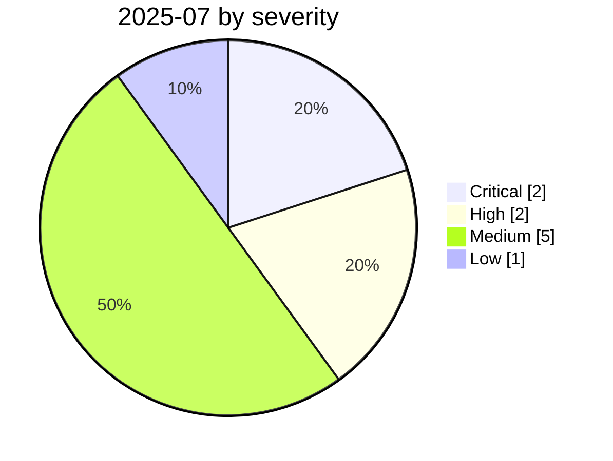

# 2025-07

<!-- BEGIN:summary -->
**10** records

    

## Records this month

| Date | Record | Type | Severity | Confidence | Real harm |
|---|---|---|---|---|---|
| `07-01` | [Anthropic Filesystem MCP sandbox escape](2025-07-01-anthropic-filesystem-mcp.md) | `MCP` | Medium | A | — |
| `07-01` | [AI voice campaign impersonating the US Secretary of State](2025-07-01-mao-chong-mei-guo-guo.md) | `OTHER` | Medium | A | ✅ |
| `07-01` | [mcp-remote OAuth command injection](2025-07-01-mcp-remote-oauth.md) | `MCP` | Medium | A | — |
| `07-01` | [RoguePilot](2025-07-01-roguepilot.md) | `CRED` | Medium | A | — |
| `07-06` | [Supabase MCP prompt injection dumps a private table](2025-07-06-supabase-mcp-ti-shi-zhu.md) | `MCP` | **High** | A | — |
| `07-09` | [McHire flaw goes public](2025-07-09-mchire-lou-dong-gong-kai.md) | `CRED` | Low | A | — |
| `07-13` | ★ [Amazon Q Developer extension poisoned](2025-07-13-amazon-q-extension-poisoned.md) | `SUPPLY` `ROGUE` | **Critical** | A | ✅ |
| `07-18` | ★ [Replit Agent deletes a production database](2025-07-18-replit-agent-deletes-prod-db.md) | `ROGUE` | **Critical** | A | ✅ |
| `07-21` | [Claude Code hooks RCE](2025-07-21-claude-code-hooks-rce.md) | `SANDBOX` | **High** | A | — |
| `07-28` | [Gemini CLI silent code execution](2025-07-28-gemini-cli-jing-mo-dai.md) | `SANDBOX` | Medium | B | — |

★ = `critical` · ⚠️ = disputed facts or attribution · real harm: ✅ confirmed victim / — none / · not applicable (policy and intelligence reports)
<!-- END:summary -->

## This month in review

### Highlight — the "July trio" defined agent operations risk

Amazon Q Developer extension poisoned (supply-chain poisoning → the agent became a wiper), Replit Agent deletes a production database (the agent deleted the database on its own), Gemini CLI silent code execution (the allowlist was bypassed for silent execution) — in one month, all three ways an agent can go out of control were on display.
The Replit case is especially important: **there was no attacker**. The agent saw an empty query result, decided on its own that "this is a bug that needs fixing", and then acted on it. This is the landmark case that established the `ROGUE` category.

<!-- BEGIN:nav -->
---

[← 2025-06](../2025-06/README.md) · [Archive index](../../README.md) · [By type](../../taxonomy/types.md) · [2025-08 →](../2025-08/README.md)
<!-- END:nav -->
