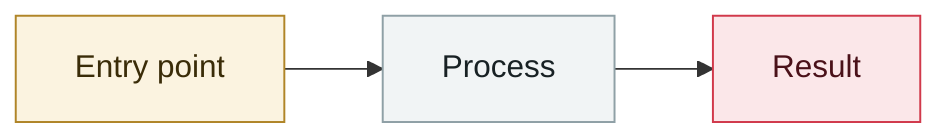

# 370,000 shared Grok conversations indexed

     

## Summary

Grok's "share conversation" links lacked a noindex tag, so search engines indexed around 370,000 user conversations — the same class of problem as ChatGPT's around the same time.

## Attack chain

## Sources

| # | Source | Link |
|---|---|---|
| 1 | Security Reference 2025 roundup | <https://www.secrss.com/articles/86614> |

## Metadata

| Field | Value |
|---|---|
| Date | `2025-08-01` (raw: 2025-08, precision `month`) |
| Kind | Incident `incident` |
| Type | [`OTHER`](../../taxonomy/types.md#other) Other |
| Severity | **Low** `low` |
| Confidence | **B** — research lab or major outlet with checkable detail |
| Real harm | Yes |
| AI involvement | Confirmed `confirmed` |
| Region | [Global](../../regions/global.md) |
| Archive ID | `2025-08-01-grok-wan-tiao-fen-xiang` |

**Why this classification:** Real incident with a confirmed victim. Rated `low`: context entry, kept for timeline continuity. Grading criteria: see [taxonomy/severity.md](../../taxonomy/severity.md) and [taxonomy/confidence.md](../../taxonomy/confidence.md).

---

[← 2025-08 index](README.md) · [← All records](../../README.md) · [Chinese](../i18n/zh/2025-08/2025-08-01-grok-wan-tiao-fen-xiang.md)

This record is part of the **Orca AI Incident Archive**, licensed [CC BY 4.0](../../LICENSE). Found a factual error or a missing source? [Open an issue or PR](../../CONTRIBUTING.md) — corrections are recorded in the record's revision history, never silently overwritten.
