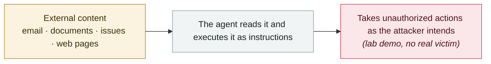

# "Man in the Prompt" browser-extension attack

     

## Summary

LayerX: a **least-privilege extension** is enough to manipulate the ChatGPT / Gemini prompt box in the browser DOM to inject instructions, hide its traces, and read confidential content including Google Workspace data

## Attack chain

## Sources

| # | Source | Link |
|---|---|---|
| 1 | LayerX (via TechRisk) | <https://techriskguru.com/p/techrisk-133-man-in-the-prompt-attack> |

## Metadata

| Field | Value |
|---|---|
| Date | `2025-08-01` (raw: 2025-08, precision `month`) |
| Kind | Research demo `research` |
| Type | [`IPI`](../../taxonomy/types.md#ipi) Indirect prompt injection |
| Severity | **Medium** `medium` |
| Confidence | **B** — research lab or major outlet with checkable detail |
| Real harm | No |
| AI involvement | Confirmed `confirmed` |
| Region | [Global](../../regions/global.md) |
| Archive ID | `2025-08-01-man-prompt-liu-lan-qi` |

**Why this classification:** Controlled demo by a research lab or vendor, `real_harm: false`; the record marks when the attack surface became public. Rated `medium`: controlled demo, moderate flaw, or an incident limited to a single user / single machine. Grading criteria: see [taxonomy/severity.md](../../taxonomy/severity.md) and [taxonomy/confidence.md](../../taxonomy/confidence.md).

## Related

**Topic:** [Zero-click data exfiltration chain](../../topics/zero-click-exfil.md)

**Related records:**

- `2025-08-06` [AgentFlayer zero-click attack set (Black Hat USA)](2025-08-06-agentflayer-black-hat-usa.md)   AgentFlayer zero-click attack set (Black Hat USA)
- `2025-08-06` [SafeBreach "Invitation Is All You Need"](2025-08-06-safebreach-invitation-is-all.md)   SafeBreach "Invitation Is All You Need"
- `2025-09-18` [ShadowLeak](../2025-09/2025-09-18-shadowleak.md)   ShadowLeak
- `2025-09-19` [Notion 3.0 agent hits the lethal trifecta](../2025-09/2025-09-19-notion-agent-zhi-ming-san.md)   Notion 3.0 agent hits the lethal trifecta

---

[← 2025-08 index](README.md) · [← All records](../../README.md) · [Chinese](../i18n/zh/2025-08/2025-08-01-man-prompt-liu-lan-qi.md)

This record is part of the **Orca AI Incident Archive**, licensed [CC BY 4.0](../../LICENSE). Found a factual error or a missing source? [Open an issue or PR](../../CONTRIBUTING.md) — corrections are recorded in the record's revision history, never silently overwritten.
