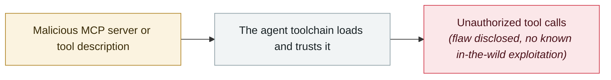

# Cursor MCPoison (CVE-2025-54136)

     

## Summary

Disclosed by Check Point Research, CVSS 8.8. Once a developer approves a harmless MCP config, the attacker can **silently swap in malicious commands without triggering re-approval** — an "approval means permanent trust" design flaw

## Attack chain

## Sources

| # | Source | Link |
|---|---|---|
| 1 | Tenable FAQ | <https://www.tenable.com/blog/faq-cve-2025-54135-cve-2025-54136-vulnerabilities-in-cursor-curxecute-mcpoison> |
| 2 | Dark Reading | <https://www.darkreading.com/vulnerabilities-threats/rce-flaw-ai-coding-tool-supply-chain-risk> |

## Metadata

| Field | Value |
|---|---|
| Date | `2025-08-05` (raw: 2025-08-05, precision `day`) |
| Kind | Vulnerability disclosure `vulnerability` |
| Type | [`MCP`](../../taxonomy/types.md#mcp) MCP & tool-chain |
| Severity | **High** `high` |
| Confidence | **A** — primary source (vendor / victim / law enforcement / official report) |
| Real harm | No |
| AI involvement | Confirmed `confirmed` |
| Region | [Global](../../regions/global.md) |
| Archive ID | `2025-08-05-cursor-mcpoison` |

**Why this classification:** Vulnerability disclosure; as of archiving there is no evidence of in-the-wild exploitation, so `real_harm: false`. Rated `high`: real damage is limited in scope, or it is a CVSS 9+ severe flaw, or a capability demonstration of significance. Grading criteria: see [taxonomy/severity.md](../../taxonomy/severity.md) and [taxonomy/confidence.md](../../taxonomy/confidence.md).

## Related

**Topic:** [Agent supply-chain poisoning](../../topics/agent-supply-chain.md)

**Related records:**

- `2025-07-06` [Supabase MCP prompt injection dumps a private table](../2025-07/2025-07-06-supabase-mcp-ti-shi-zhu.md)   Supabase MCP prompt injection dumps a private table
- `2025-09-03` [Claude Code MCP auto-enable bypass](../2025-09/2025-09-03-claude-code-mcp.md)   Claude Code MCP auto-enable bypass
- `2025-09-25` [postmark-mcp malicious npm package](../2025-09/2025-09-25-postmark-mcp-npm.md)   postmark-mcp malicious npm package
- `2025-07-01` [Anthropic Filesystem MCP sandbox escape](../2025-07/2025-07-01-anthropic-filesystem-mcp.md)   Anthropic Filesystem MCP sandbox escape

---

[← 2025-08 index](README.md) · [← All records](../../README.md) · [Chinese](../i18n/zh/2025-08/2025-08-05-cursor-mcpoison.md)

This record is part of the **Orca AI Incident Archive**, licensed [CC BY 4.0](../../LICENSE). Found a factual error or a missing source? [Open an issue or PR](../../CONTRIBUTING.md) — corrections are recorded in the record's revision history, never silently overwritten.
