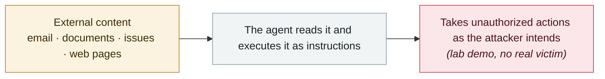

# SafeBreach "Invitation Is All You Need"

     

## Summary

Or Yair / Ben Nassi / Stav Cohen presented **Targeted Promptware** at Black Hat USA: hijacking Gemini for Workspace through Google Calendar invitations, with **15 exploits** spanning web / mobile / Google Assistant that could generate harmful content, spam and phishing, delete calendar events, **control smart-home devices**, and reach video streams and location. Disclosed responsibly to Google in 2025-02; their TARA assessment rated **73% of the risks High-Critical**

## Attack chain

## Sources

| # | Source | Link |
|---|---|---|
| 1 | SafeBreach | <https://www.safebreach.com/blog/invitation-is-all-you-need-hacking-gemini/> |

## Metadata

| Field | Value |
|---|---|
| Date | `2025-08-06` (raw: 2025-08-06, precision `day`) |
| Kind | Research demo `research` |
| Type | [`IPI`](../../taxonomy/types.md#ipi) Indirect prompt injection |
| Severity | **High** `high` |
| Confidence | **A** — primary source (vendor / victim / law enforcement / official report) |
| Real harm | No |
| AI involvement | Confirmed `confirmed` |
| Region | [Global](../../regions/global.md) |
| Archive ID | `2025-08-06-safebreach-invitation-is-all` |

**Why this classification:** Controlled demo by a research lab or vendor, `real_harm: false`; the record marks when the attack surface became public. Rated `high`: real damage is limited in scope, or it is a CVSS 9+ severe flaw, or a capability demonstration of significance. Grading criteria: see [taxonomy/severity.md](../../taxonomy/severity.md) and [taxonomy/confidence.md](../../taxonomy/confidence.md).

## Related

**Topic:** [Zero-click data exfiltration chain](../../topics/zero-click-exfil.md)

**Related records:**

- `2025-08-06` [AgentFlayer zero-click attack set (Black Hat USA)](2025-08-06-agentflayer-black-hat-usa.md)   AgentFlayer zero-click attack set (Black Hat USA)
- `2025-08-01` ["Man in the Prompt" browser-extension attack](2025-08-01-man-prompt-liu-lan-qi.md)   "Man in the Prompt" browser-extension attack
- `2025-09-18` [ShadowLeak](../2025-09/2025-09-18-shadowleak.md)   ShadowLeak
- `2025-09-19` [Notion 3.0 agent hits the lethal trifecta](../2025-09/2025-09-19-notion-agent-zhi-ming-san.md)   Notion 3.0 agent hits the lethal trifecta

---

[← 2025-08 index](README.md) · [← All records](../../README.md) · [Chinese](../i18n/zh/2025-08/2025-08-06-safebreach-invitation-is-all.md)

This record is part of the **Orca AI Incident Archive**, licensed [CC BY 4.0](../../LICENSE). Found a factual error or a missing source? [Open an issue or PR](../../CONTRIBUTING.md) — corrections are recorded in the record's revision history, never silently overwritten.
