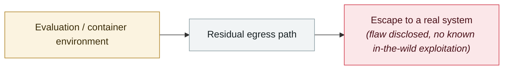

# OpenAI Codex CLI config hijack

     

## Summary

CVE-2025-61260, CVSS 9.8. Codex automatically loads project-local `.env` and `.codex/config.toml` without user confirmation, so they can embed arbitrary commands that execute immediately. Affects ≤ v0.23.0, fixed 08-20

## Attack chain

## Sources

| # | Source | Link |
|---|---|---|
| 1 | GHSA-xrxf-jgv3-qmrm | <https://github.com/advisories/GHSA-xrxf-jgv3-qmrm> |

## Metadata

| Field | Value |
|---|---|
| Date | `2025-08-07` (raw: 2025-08-07, precision `day`) |
| Kind | Vulnerability disclosure `vulnerability` |
| Type | [`SANDBOX`](../../taxonomy/types.md#sandbox) Sandbox escape |
| Severity | **High** `high` |
| Confidence | **A** — primary source (vendor / victim / law enforcement / official report) |
| Real harm | No |
| AI involvement | Confirmed `confirmed` |
| Region | [Global](../../regions/global.md) |
| Archive ID | `2025-08-07-codex-cli-pei-zhi-jie` |

**Why this classification:** Vulnerability disclosure; as of archiving there is no evidence of in-the-wild exploitation, so `real_harm: false`. Rated `high`: real damage is limited in scope, or it is a CVSS 9+ severe flaw, or a capability demonstration of significance. Grading criteria: see [taxonomy/severity.md](../../taxonomy/severity.md) and [taxonomy/confidence.md](../../taxonomy/confidence.md).

## Related

**Topic:** [Frontier model autonomous overreach](../../topics/eval-escapes.md)

**Related records:**

- `2025-08-01` [Cursor CurXecute (CVE-2025-54135)](2025-08-01-cursor-curxecute.md)   Cursor CurXecute (CVE-2025-54135)
- `2025-07-21` [Claude Code hooks RCE](../2025-07/2025-07-21-claude-code-hooks-rce.md)   Claude Code hooks RCE
- `2025-07-28` [Gemini CLI silent code execution](../2025-07/2025-07-28-gemini-cli-jing-mo-dai.md)   Gemini CLI silent code execution
- `2025-12-06` [IDEsaster](../2025-12/2025-12-06-idesaster.md)   IDEsaster

---

[← 2025-08 index](README.md) · [← All records](../../README.md) · [Chinese](../i18n/zh/2025-08/2025-08-07-codex-cli-pei-zhi-jie.md)

This record is part of the **Orca AI Incident Archive**, licensed [CC BY 4.0](../../LICENSE). Found a factual error or a missing source? [Open an issue or PR](../../CONTRIBUTING.md) — corrections are recorded in the record's revision history, never silently overwritten.
