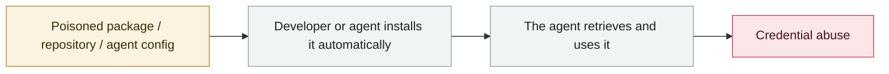

# Salesloft Drift OAuth token theft

      

## Summary

UNC6395 stole the OAuth tokens of the Drift AI chat agent, impersonated a trusted app and, over 10 days, systematically exported **700+ organizations'** Salesforce / Google Workspace / Slack data. Victims include Cloudflare, Google, PagerDuty, Palo Alto Networks, Proofpoint, SpyCloud, Tanium and Zscaler. **No exploit, no phishing — the trust chain of the AI integration itself was broken through**. GTIG published its report on 08-26

## Attack chain

## Details

In many general security reports this event is filed as an "OAuth leak", but the essence is that **the AI chat agent was granted long-lived, high-privilege cross-SaaS tokens because its job requires them**. Once that AI vendor is taken down, the 700-plus enterprises connected to it fall with it.
This is the most typical structural risk of the agent era: **an agent's value comes from the breadth of its permissions, and that breadth is the blast radius.**

## Sources

| # | Source | Link |
|---|---|---|
| 1 | Google Cloud/Mandiant | <https://cloud.google.com/blog/topics/threat-intelligence/data-theft-salesforce-instances-via-salesloft-drift> |
| 2 | THN | <https://thehackernews.com/2025/08/salesloft-oauth-breach-via-drift-ai.html> |
| 3 | FINRA | <https://www.finra.org/rules-guidance/guidance/salesloft-drift-AI-supply-chain-attack> |

## Metadata

| Field | Value |
|---|---|
| Date | `2025-08-08` → `2025-08-18` (raw: 2025-08-08→18, precision `day`) |
| Kind | Incident `incident` |
| Type | [`SUPPLY`](../../taxonomy/types.md#supply) Supply-chain poisoning · [`CRED`](../../taxonomy/types.md#cred) Credential abuse |
| Severity | **Critical** `critical` |
| Confidence | **A** — primary source (vendor / victim / law enforcement / official report) |
| Real harm | Yes |
| AI involvement | Confirmed `confirmed` |
| Region | [Global](../../regions/global.md) |
| Archive ID | `2025-08-08-salesloft-drift-oauth-theft` |

**Why this classification:** Real incident with a confirmed victim. Rated `critical`: confirmed real damage at the multi-organization / government / critical-infrastructure / supply-chain-worm level, or a first-of-its-kind capability milestone with real victims. Grading criteria: see [taxonomy/severity.md](../../taxonomy/severity.md) and [taxonomy/confidence.md](../../taxonomy/confidence.md).

## Related

**Topic:** [Agent supply-chain poisoning](../../topics/agent-supply-chain.md)

**Related records:**

- `2025-08-26` [Nx "s1ngularity"](2025-08-26-nx-s1ngularity.md)   Nx "s1ngularity"
- `2025-08-28` [TransUnion leaks 4.4-4.5M people via a third-party app](2025-08-28-transunion-jing-di-san-fang.md)   TransUnion leaks 4.4-4.5M people via a third-party app
- `2025-07-13` [Amazon Q Developer extension poisoned](../2025-07/2025-07-13-amazon-q-extension-poisoned.md)   Amazon Q Developer extension poisoned
- `2025-09-15` [Shai-Hulud npm worm v1](../2025-09/2025-09-15-shai-hulud-npm.md)   Shai-Hulud npm worm v1

---

[← 2025-08 index](README.md) · [← All records](../../README.md) · [Chinese](../i18n/zh/2025-08/2025-08-08-salesloft-drift-oauth-theft.md)

This record is part of the **Orca AI Incident Archive**, licensed [CC BY 4.0](../../LICENSE). Found a factual error or a missing source? [Open an issue or PR](../../CONTRIBUTING.md) — corrections are recorded in the record's revision history, never silently overwritten.
