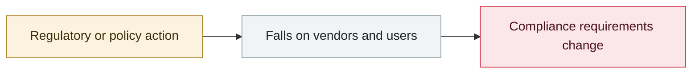

# Anthropic starts the Claude for Chrome pilot

     

## Summary

Just 1,000 Max users. By its own account: **a 23.6% prompt-injection attack success rate without mitigations, dropping to 11.2% with them**

## Attack chain

## Sources

| # | Source | Link |
|---|---|---|
| 1 | Anthropic | <https://claude.com/blog/claude-for-chrome> |
| 2 | VentureBeat | <https://venturebeat.com/infrastructure/anthropic-launches-claude-for-chrome-in-limited-beta-but-prompt-injection-attacks-remain-a-major-concern> |

## Metadata

| Field | Value |
|---|---|
| Date | `2025-08-25` (raw: 2025-08-25, precision `day`) |
| Kind | Policy & regulation `policy` |
| Type | [`GOV`](../../taxonomy/types.md#gov) Governance & policy |
| Severity | **Info** `info` |
| Confidence | **A** — primary source (vendor / victim / law enforcement / official report) |
| Real harm | n/a |
| AI involvement | Confirmed `confirmed` |
| Region | [Global](../../regions/global.md) |
| Archive ID | `2025-08-25-anthropic-claude-chrome` |

**Why this classification:** Policy / regulatory action, not counted in incident statistics; `severity` is recorded as `info`. Grading criteria: see [taxonomy/severity.md](../../taxonomy/severity.md) and [taxonomy/confidence.md](../../taxonomy/confidence.md).

## Related

**Topic:** [Defense & governance](../../topics/defense.md)

**Related records:**

- `2025-06-16` [Simon Willison names the "lethal trifecta"](../2025-06/2025-06-16-simon-willison-ti-chu-zhi.md)   Simon Willison names the "lethal trifecta"
- `2025-10-07` [OpenAI October threat report](../2025-10/2025-10-07-shi-wei-xie-bao-gao.md)   OpenAI October threat report
- `2025-10-21` [OpenAI launches the Atlas browser](../2025-10/2025-10-21-atlas-liu-lan-qi-fa.md)   OpenAI launches the Atlas browser
- `2025-11-19` [EU "Digital Omnibus" proposes delaying the AI Act](../2025-11/2025-11-19-digital-omnibus-act.md)   EU "Digital Omnibus" proposes delaying the AI Act

---

[← 2025-08 index](README.md) · [← All records](../../README.md) · [Chinese](../i18n/zh/2025-08/2025-08-25-anthropic-claude-chrome.md)

This record is part of the **Orca AI Incident Archive**, licensed [CC BY 4.0](../../LICENSE). Found a factual error or a missing source? [Open an issue or PR](../../CONTRIBUTING.md) — corrections are recorded in the record's revision history, never silently overwritten.
