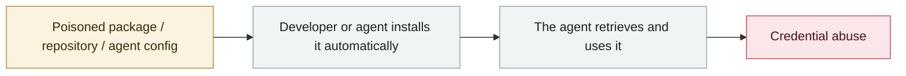

# Nx "s1ngularity"

      

## Summary

**The first malware to weaponize AI CLIs**: it checks whether Claude Code / Gemini CLI / Amazon Q are installed locally, then **directs those agents to scan for and collect credentials**. It steals GitHub tokens, SSH keys, wallets and private keys and writes them into public repositories the attackers created. Affected **2,180 GitHub accounts and 7,200 repositories**

## Attack chain

## Sources

| # | Source | Link |
|---|---|---|
| 1 | Wiz | <https://www.wiz.io/blog/s1ngularity-supply-chain-attack> |
| 2 | BleepingComputer | <https://www.bleepingcomputer.com/news/security/ai-powered-malware-hit-2-180-github-accounts-in-s1ngularity-attack/> |

## Metadata

| Field | Value |
|---|---|
| Date | `2025-08-26` (raw: 2025-08-26, precision `day`) |
| Kind | Incident `incident` |
| Type | [`SUPPLY`](../../taxonomy/types.md#supply) Supply-chain poisoning · [`CRED`](../../taxonomy/types.md#cred) Credential abuse |
| Severity | **Critical** `critical` |
| Confidence | **A** — primary source (vendor / victim / law enforcement / official report) |
| Real harm | Yes |
| AI involvement | Confirmed `confirmed` |
| Region | [Global](../../regions/global.md) |
| Archive ID | `2025-08-26-nx-s1ngularity` |

**Why this classification:** Real incident with a confirmed victim. Rated `critical`: confirmed real damage at the multi-organization / government / critical-infrastructure / supply-chain-worm level, or a first-of-its-kind capability milestone with real victims. Grading criteria: see [taxonomy/severity.md](../../taxonomy/severity.md) and [taxonomy/confidence.md](../../taxonomy/confidence.md).

## Related

**Topic:** [Agent supply-chain poisoning](../../topics/agent-supply-chain.md)

**Related records:**

- `2025-08-08` [Salesloft Drift OAuth token theft](2025-08-08-salesloft-drift-oauth-theft.md)   Salesloft Drift OAuth token theft
- `2025-08-28` [TransUnion leaks 4.4-4.5M people via a third-party app](2025-08-28-transunion-jing-di-san-fang.md)   TransUnion leaks 4.4-4.5M people via a third-party app
- `2025-07-13` [Amazon Q Developer extension poisoned](../2025-07/2025-07-13-amazon-q-extension-poisoned.md)   Amazon Q Developer extension poisoned
- `2025-09-15` [Shai-Hulud npm worm v1](../2025-09/2025-09-15-shai-hulud-npm.md)   Shai-Hulud npm worm v1

---

[← 2025-08 index](README.md) · [← All records](../../README.md) · [Chinese](../i18n/zh/2025-08/2025-08-26-nx-s1ngularity.md)

This record is part of the **Orca AI Incident Archive**, licensed [CC BY 4.0](../../LICENSE). Found a factual error or a missing source? [Open an issue or PR](../../CONTRIBUTING.md) — corrections are recorded in the record's revision history, never silently overwritten.
