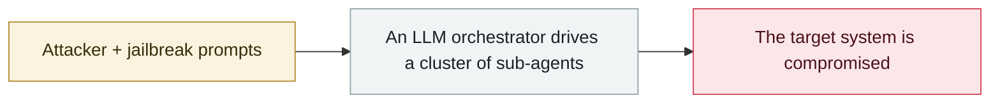

# Anthropic August threat report

     

## Summary

① **GTG-2002 "vibe hacking"**: a single actor used Claude Code to carry out data extortion against **at least 17 organizations** (healthcare, emergency services, government, religious) **within a single month**. Claude Code handled the whole chain — reconnaissance, exploitation, malware development, data theft and extortion — and **even analyzed victims' financial records to set ransom amounts** and generated HTML ransom notes embedded in victim machines; ransoms sometimes exceeded **$500,000** ② North Korean fake-identity IT job seekers at scale ③ UK-based actor GTG-5004 used Claude to develop and sell ransomware

## Attack chain

## Sources

| # | Source | Link |
|---|---|---|
| 1 | Anthropic | <https://www.anthropic.com/news/detecting-countering-misuse-aug-2025> |
| 2 | report PDF | <https://www-cdn.anthropic.com/b2a76c6f6992465c09a6f2fce282f6c0cea8c200.pdf> |
| 3 | Dark Reading | <https://www.darkreading.com/cyberattacks-data-breaches/anthropic-ai-automate-data-extortion-campaign> |

## Metadata

| Field | Value |
|---|---|
| Date | `2025-08-27` (raw: 2025-08-27, precision `day`) |
| Kind | Threat report `report` |
| Type | [`WEAPON`](../../taxonomy/types.md#weapon) Agent used as a weapon |
| Severity | **Info** `info` |
| Confidence | **A** — primary source (vendor / victim / law enforcement / official report) |
| Real harm | n/a |
| AI involvement | Confirmed `confirmed` |
| Region | [Global](../../regions/global.md) |
| Archive ID | `2025-08-27-anthropic-ba-wei-xie-bao` |

**Why this classification:** Threat intelligence report covering several incidents; it is not counted as a single incident itself, so `severity` is recorded as `info`. Grading criteria: see [taxonomy/severity.md](../../taxonomy/severity.md) and [taxonomy/confidence.md](../../taxonomy/confidence.md).

## Related

**Topic:** [Offensive AI capability evolution](../../topics/offensive-ai.md)

**Related records:**

- `2025-08-26` [ESET finds PromptLock](2025-08-26-eset-promptlock-fa-xian.md)   ESET finds PromptLock
- `2025-09-02` [HexStrike-AI turned on a Citrix zero-day](../2025-09/2025-09-02-hexstrike-citrix-day.md)   HexStrike-AI turned on a Citrix zero-day
- `2025-09-01` [Villager (Cyberspike) AI pentest tool](../2025-09/2025-09-01-villager-cyberspike-shen-tou-gong.md)   Villager (Cyberspike) AI pentest tool
- `2025-09-15` [Anthropic detects GTG-1002](../2025-09/2025-09-15-anthropic-gtg-jian-ce-dao.md)   Anthropic detects GTG-1002

---

[← 2025-08 index](README.md) · [← All records](../../README.md) · [Chinese](../i18n/zh/2025-08/2025-08-27-anthropic-ba-wei-xie-bao.md)

This record is part of the **Orca AI Incident Archive**, licensed [CC BY 4.0](../../LICENSE). Found a factual error or a missing source? [Open an issue or PR](../../CONTRIBUTING.md) — corrections are recorded in the record's revision history, never silently overwritten.
