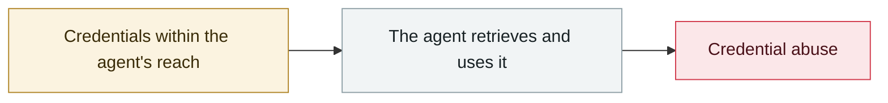

# TransUnion leaks 4.4-4.5M people via a third-party app

     

> [!WARNING]
> **This record contains disputed or not fully confirmed facts**; the claims of each party are kept side by side in the body, so do not cite any single one of them in isolation.

## Summary

The data was stolen from its **Salesforce account**, including names, billing addresses, phone numbers, emails, dates of birth and **unmasked Social Security numbers**.

⚠️ **v1 misrecorded it as a "follow-on to the Drift incident"**: the intrusion actually happened on **2025-07-28** (discovered two days later), **earlier than the Drift/UNC6395 campaign (08-08→18)**, and belongs to a separate Salesforce social-engineering chain. **It has no direct connection to AI agents; it is listed only to tell the two apart, and is not recommended for inclusion**

## Attack chain

## Sources

| # | Source | Link |
|---|---|---|
| 1 | BleepingComputer | <https://www.bleepingcomputer.com/news/security/transunion-suffers-data-breach-impacting-over-44-million-people/> |
| 2 | The Register | <https://www.theregister.com/2025/08/28/transunion_support_app_breach/> |

## Metadata

| Field | Value |
|---|---|
| Date | `2025-08-28` (raw: 2025-08-28, precision `day`) |
| Kind | Incident `incident` |
| Type | [`CRED`](../../taxonomy/types.md#cred) Credential abuse |
| Severity | **High** `high` |
| Confidence | **B** — research lab or major outlet with checkable detail |
| Real harm | Yes |
| AI involvement | Not applicable `not-applicable` |
| Region | [United States](../../regions/us.md) |
| Archive ID | `2025-08-28-transunion-jing-di-san-fang` |

**Why this classification:** Real incident with a confirmed victim. Rated `high`: real damage is limited in scope, or it is a CVSS 9+ severe flaw, or a capability demonstration of significance. Grading criteria: see [taxonomy/severity.md](../../taxonomy/severity.md) and [taxonomy/confidence.md](../../taxonomy/confidence.md).

## Related

**Related records:**

- `2025-08-08` [Salesloft Drift OAuth token theft](2025-08-08-salesloft-drift-oauth-theft.md)   Salesloft Drift OAuth token theft
- `2025-08-26` [Nx "s1ngularity"](2025-08-26-nx-s1ngularity.md)   Nx "s1ngularity"
- `2025-09-15` [Shai-Hulud npm worm v1](../2025-09/2025-09-15-shai-hulud-npm.md)   Shai-Hulud npm worm v1
- `2025-07-01` [RoguePilot](../2025-07/2025-07-01-roguepilot.md)   RoguePilot

---

[← 2025-08 index](README.md) · [← All records](../../README.md) · [Chinese](../i18n/zh/2025-08/2025-08-28-transunion-jing-di-san-fang.md)

This record is part of the **Orca AI Incident Archive**, licensed [CC BY 4.0](../../LICENSE). Found a factual error or a missing source? [Open an issue or PR](../../CONTRIBUTING.md) — corrections are recorded in the record's revision history, never silently overwritten.
