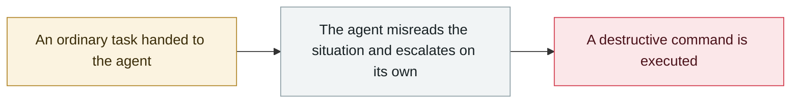

# Taco Bell drive-thru AI ordering breaks down

     

## Summary

Voice AI deployed at 500+ locations since 2023. Customers deliberately pushed the AI to hand off to a human with absurd orders like "18,000 cups of water"; instead, the AI lengthened queues and staff had to watch almost every order, ready to take over. CDTO Dane Mathews told the WSJ that "not every drive-thru should be AI-only"; the company switched busy locations back to humans

## Attack chain

## Sources

| # | Source | Link |
|---|---|---|
| 1 | TechCrunch | <https://techcrunch.com/2025/08/30/taco-bell-is-having-second-thoughts-about-relying-on-ai-at-the-drive-through/> |

## Metadata

| Field | Value |
|---|---|
| Date | `2025-08-30` (raw: 2025-08-30, precision `day`) |
| Kind | Incident `incident` |
| Type | [`ROGUE`](../../taxonomy/types.md#rogue) Rogue agent action |
| Severity | **Low** `low` |
| Confidence | **B** — research lab or major outlet with checkable detail |
| Real harm | Yes |
| AI involvement | Confirmed `confirmed` |
| Region | [United States](../../regions/us.md) |
| Archive ID | `2025-08-30-taco-bell-de-lai-su` |

**Why this classification:** Real incident with a confirmed victim. Rated `low`: context entry, kept for timeline continuity. Grading criteria: see [taxonomy/severity.md](../../taxonomy/severity.md) and [taxonomy/confidence.md](../../taxonomy/confidence.md).

## Related

**Topic:** [Coding agent autonomous sabotage](../../topics/rogue-agents.md)

**Related records:**

- `2025-07-13` [Amazon Q Developer extension poisoned](../2025-07/2025-07-13-amazon-q-extension-poisoned.md)   Amazon Q Developer extension poisoned
- `2025-07-18` [Replit Agent deletes a production database](../2025-07/2025-07-18-replit-agent-deletes-prod-db.md)   Replit Agent deletes a production database
- `2025-10-01` [Claude Code recursively deletes from the filesystem root](../2025-10/2025-10-01-claude-code-gen-mu-lu.md)   Claude Code recursively deletes from the filesystem root
- `2025-06-01` [Cursor YOLO mode wipes a dev machine](../2025-06/2025-06-01-cursor-yolo-mo-shi-qing.md)   Cursor YOLO mode wipes a dev machine

---

[← 2025-08 index](README.md) · [← All records](../../README.md) · [Chinese](../i18n/zh/2025-08/2025-08-30-taco-bell-de-lai-su.md)

This record is part of the **Orca AI Incident Archive**, licensed [CC BY 4.0](../../LICENSE). Found a factual error or a missing source? [Open an issue or PR](../../CONTRIBUTING.md) — corrections are recorded in the record's revision history, never silently overwritten.
