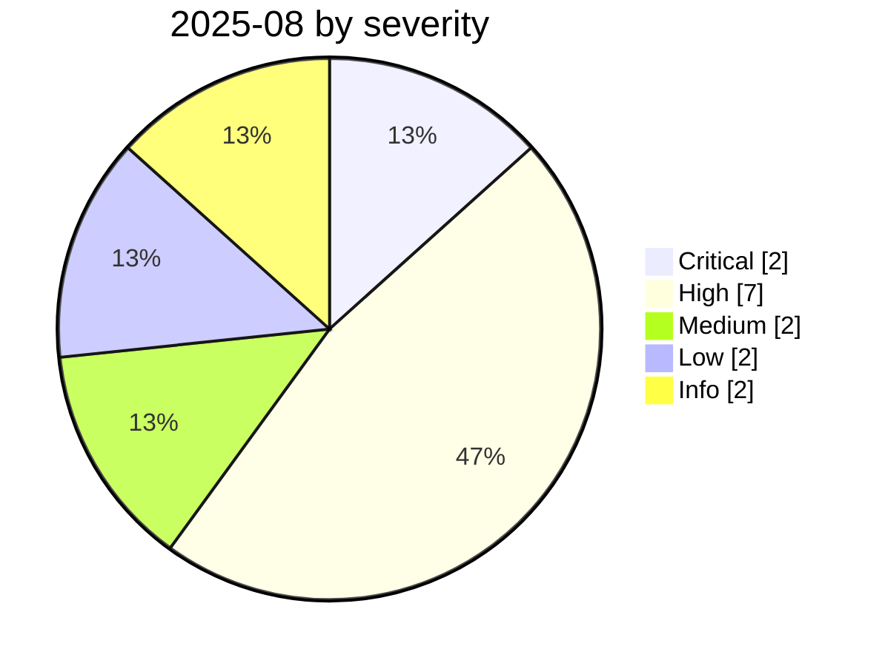

# 2025-08

<!-- BEGIN:summary -->
**15** records

     

## Records this month

| Date | Record | Type | Severity | Confidence | Real harm |
|---|---|---|---|---|---|
| `08-01` | [Cursor CurXecute (CVE-2025-54135)](2025-08-01-cursor-curxecute.md) ⚠️ | `SANDBOX` | **High** | A | — |
| `08-01` | [ChatGPT share links indexed by Google](2025-08-01-chatgpt-google-fen-xiang-lian.md) | `OTHER` | Medium | B | ✅ |
| `08-01` | ["Man in the Prompt" browser-extension attack](2025-08-01-man-prompt-liu-lan-qi.md) | `IPI` | Medium | B | — |
| `08-01` | [370,000 shared Grok conversations indexed](2025-08-01-grok-wan-tiao-fen-xiang.md) | `OTHER` | Low | B | ✅ |
| `08-05` | [Cursor MCPoison (CVE-2025-54136)](2025-08-05-cursor-mcpoison.md) | `MCP` | **High** | A | — |
| `08-06` | [AgentFlayer zero-click attack set (Black Hat USA)](2025-08-06-agentflayer-black-hat-usa.md) | `IPI` `EXFIL` | **High** | A | — |
| `08-06` | [SafeBreach "Invitation Is All You Need"](2025-08-06-safebreach-invitation-is-all.md) | `IPI` | **High** | A | — |
| `08-07` | [OpenAI Codex CLI config hijack](2025-08-07-codex-cli-pei-zhi-jie.md) | `SANDBOX` | **High** | A | — |
| `08-08` | ★ [Salesloft Drift OAuth token theft](2025-08-08-salesloft-drift-oauth-theft.md) | `SUPPLY` `CRED` | **Critical** | A | ✅ |
| `08-25` | [Anthropic starts the Claude for Chrome pilot](2025-08-25-anthropic-claude-chrome.md) | `GOV` | Info | A | · |
| `08-26` | ★ [Nx "s1ngularity"](2025-08-26-nx-s1ngularity.md) | `SUPPLY` `CRED` | **Critical** | A | ✅ |
| `08-26` | [ESET finds PromptLock](2025-08-26-eset-promptlock-fa-xian.md) | `WEAPON` | **High** | A | ✅ |
| `08-27` | [Anthropic August threat report](2025-08-27-anthropic-ba-wei-xie-bao.md) | `WEAPON` | Info | A | · |
| `08-28` | [TransUnion leaks 4.4-4.5M people via a third-party app](2025-08-28-transunion-jing-di-san-fang.md) ⚠️ | `CRED` | **High** | B | ✅ |
| `08-30` | [Taco Bell drive-thru AI ordering breaks down](2025-08-30-taco-bell-de-lai-su.md) | `ROGUE` | Low | B | ✅ |

★ = `critical` · ⚠️ = disputed facts or attribution · real harm: ✅ confirmed victim / — none / · not applicable (policy and intelligence reports)
<!-- END:summary -->

<!-- BEGIN:nav -->
---

[← 2025-07](../2025-07/README.md) · [Archive index](../../README.md) · [By type](../../taxonomy/types.md) · [2025-09 →](../2025-09/README.md)
<!-- END:nav -->
