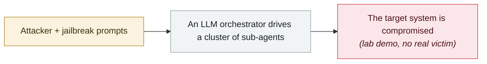

# Villager (Cyberspike) AI pentest tool

     

## Summary

Uploaded to PyPI in late 2025-07 by user `stupidfish001` (a former CTF player from China's HSCSEC team). Kali toolchain + **DeepSeek** + **MCP client**, with a built-in database of **4,201 AI system prompts**, automatically creating isolated Kali containers on demand. **11,000 downloads** in two months; described as "Cobalt Strike's AI-native successor"

## Attack chain

## Sources

| # | Source | Link |
|---|---|---|
| 1 | Straiker | <https://www.straiker.ai/blog/cyberspike-villager-cobalt-strike-ai-native-successor> |
| 2 | THN | <https://thehackernews.com/2025/09/ai-powered-villager-pen-testing-tool.html> |

## Metadata

| Field | Value |
|---|---|
| Date | `2025-09-01` (raw: 2025-09, precision `month`) |
| Kind | Research demo `research` |
| Type | [`WEAPON`](../../taxonomy/types.md#weapon) Agent used as a weapon |
| Severity | **High** `high` |
| Confidence | **A** — primary source (vendor / victim / law enforcement / official report) |
| Real harm | Yes |
| AI involvement | Confirmed `confirmed` |
| Region | [China](../../regions/cn.md) · [Global](../../regions/global.md) |
| Archive ID | `2025-09-01-villager-cyberspike-shen-tou-gong` |

**Why this classification:** Controlled demo by a research lab or vendor, `real_harm: false`; the record marks when the attack surface became public. Rated `high`: real damage is limited in scope, or it is a CVSS 9+ severe flaw, or a capability demonstration of significance. Grading criteria: see [taxonomy/severity.md](../../taxonomy/severity.md) and [taxonomy/confidence.md](../../taxonomy/confidence.md).

## Related

**Topic:** [Offensive AI capability evolution](../../topics/offensive-ai.md)

**Related records:**

- `2025-09-02` [HexStrike-AI turned on a Citrix zero-day](2025-09-02-hexstrike-citrix-day.md)   HexStrike-AI turned on a Citrix zero-day
- `2025-09-15` [Anthropic detects GTG-1002](2025-09-15-anthropic-gtg-jian-ce-dao.md)   Anthropic detects GTG-1002
- `2025-08-26` [ESET finds PromptLock](../2025-08/2025-08-26-eset-promptlock-fa-xian.md)   ESET finds PromptLock
- `2025-08-27` [Anthropic August threat report](../2025-08/2025-08-27-anthropic-ba-wei-xie-bao.md)   Anthropic August threat report

---

[← 2025-09 index](README.md) · [← All records](../../README.md) · [Chinese](../i18n/zh/2025-09/2025-09-01-villager-cyberspike-shen-tou-gong.md)

This record is part of the **Orca AI Incident Archive**, licensed [CC BY 4.0](../../LICENSE). Found a factual error or a missing source? [Open an issue or PR](../../CONTRIBUTING.md) — corrections are recorded in the record's revision history, never silently overwritten.
